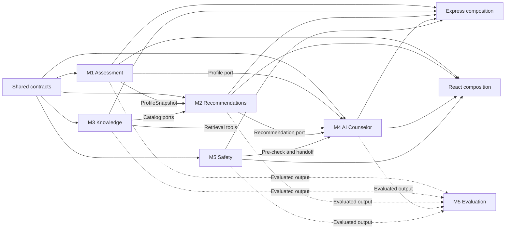

# YuvaNext Collaboration and Integration Plan

## Purpose

This document defines how five colleagues can build the YuvaNext POCs in parallel without producing five incompatible applications. It separates three boundaries:

- **Deployment boundary:** React/Vite frontend and Express backend.
- **Product ownership boundary:** five domain modules.
- **Integration boundary:** shared contracts and composition roots controlled by an integration owner.

The five modules remain the work-assignment model. Frontend/backend remains the runtime structure. Neither boundary replaces the other.

Related specifications:

- [Five-module POC master plan](../poc/README.md)
- [System and AI workflow](yuvanext-system-workflow.md)
- [Phase 1 PRD](../reference/prd-phase1.md.docx)

## 1. Target repository shape

```text
career-counseling-chatbot/
├─ apps/
│  ├─ web/                         # React/Vite composition shell
│  │  └─ src/
│  │     ├─ app/                   # integration-owned router/providers
│  │     ├─ features/              # module-owned UI features
│  │     ├─ components/            # reviewed shared UI
│  │     └─ lib/                   # generated client and utilities
│  └─ api/                         # Express composition shell
│     └─ src/
│        ├─ app/                   # middleware and registration
│        ├─ adapters/              # runtime provider wiring
│        ├─ jobs/                  # worker registration
│        └─ server.ts
├─ packages/
│  ├─ contracts/                   # Zod schemas and public types
│  ├─ assessment/                  # Module 1
│  ├─ recommendations/             # Module 2
│  ├─ knowledge/                   # Module 3
│  ├─ counselor/                   # Module 4
│  ├─ safety/                      # Module 5
│  ├─ evaluation/                  # Module 5, cross-cutting
│  ├─ ui/
│  ├─ config/
│  └─ test-fixtures/
├─ data/
├─ tests/
├─ docs/
├─ scripts/
└─ infra/
```

`apps/web` and `apps/api` are thin composition shells. Business rules stay in domain packages. Each package exposes a small public entry point; its other files remain private.

## 2. Ownership model

| Module                               | Package ownership                        | UI ownership                      | Main published contract                   |
| ------------------------------------ | ---------------------------------------- | --------------------------------- | ----------------------------------------- |
| 1. Onboarding and Assessment         | `packages/assessment`                    | identity, intake, assessment      | `ProfileSnapshot`                         |
| 2. Recommendation and Planning       | `packages/recommendations`               | guidance and recommendation views | `RecommendationSet`                       |
| 3. Knowledge and Grounding           | `packages/knowledge`, `data`, ingestion  | source-detail views if required   | catalog records and retrieval tools       |
| 4. AI Counselor and Experience       | `packages/counselor`                     | chat, canvas, reports, sharing    | `AssistantTurn`, widgets, report snapshot |
| 5. Safety, Evaluation and Operations | `packages/safety`, `packages/evaluation` | safety and staff views            | `SafetyDecision`, `HandoffPacket`         |

The integration owner maintains:

- Express bootstrap, middleware order and module registration.
- React root router and global providers.
- workspace, TypeScript, lint, test and CI configuration.
- contract export policy and generated API client.
- migration ordering and integration branches.

The integration owner reviews boundaries; they do not implement every module.

## 3. Dependency direction



Rules:

1. Every module may import `contracts` and `config`.
2. Module 2 consumes Modules 1 and 3 through public ports/contracts.
3. Module 4 consumes Modules 1–3 and Module 5 through typed adapters.
4. Evaluation observes public outputs but is not a runtime dependency of domain logic.
5. Circular domain-package imports are forbidden.
6. Frontend code never imports backend package internals.

## 4. Contract-first starting gate

Parallel integration begins only after Zod schemas and example payloads exist for:

```text
UserProfile
ConsentStatus
AssessmentDefinition
AssessmentResponse
AssessmentResult
ProfileSnapshot
CatalogEntity
RetrievedEvidence
RecommendationRequest
RecommendationSet
CounselorToolCall
AssistantTurn
WidgetDirective
SafetyDecision
HandoffPacket
ReportSnapshot
ApiError
EventEnvelope
```

Every public contract includes:

- Zod runtime schema and inferred TypeScript type.
- valid and important invalid fixtures.
- schema version, producer and consumers.
- compatibility notes.

The contract package contains declarations, not business calculations. Assessment scoring remains in Module 1, recommendation ranking in Module 2, and safety tiering in Module 5.

## 5. Contract-change protocol

No colleague changes a shared payload silently.

1. Describe the reason and affected consumers.
2. Update the Zod schema and fixtures together.
3. Mark the change additive, deprecating or breaking.
4. Run producer and consumer contract tests.
5. Obtain approval from the contract maintainer and affected module owners.
6. Version breaking changes and provide a migration window.
7. Merge the contract before implementation branches depend on it.

Adding an optional field is usually compatible. Renaming a field or changing its meaning is breaking even when TypeScript still compiles.

## 6. Mock-first parallel development

```text
Contract and fixture
       │
       ├─ Producer builds real implementation
       │
       └─ Consumer builds against mock adapter
                    │
                    ▼
             Contract test gate
                    │
                    ▼
          Replace mock with real adapter
```

- Module 2 starts with Explorer, Pathfinder and Launcher `ProfileSnapshot` fixtures.
- Module 4 starts with profile, recommendation, retrieval and safety fixtures.
- Module 5 starts with versioned events and synthetic safety cases.
- React uses Mock Service Worker or an equivalent typed mock layer.
- Every mock must parse through the production Zod schema.

## 7. Express integration

Each backend package exports a narrow registration function:

```ts
type ModuleContext = {
  db: Database;
  logger: SafeLogger;
  events: EventPublisher;
  config: RuntimeConfig;
};

registerAssessmentRoutes(router, context);
registerRecommendationRoutes(router, context);
registerKnowledgeRoutes(router, context);
registerCounselorRoutes(router, context);
registerSafetyRoutes(router, context);
```

The integration owner registers these under `/api/v1`. Module pull requests do not repeatedly edit `server.ts`.

Cross-domain calls use application ports, not internal HTTP calls. The POC remains a modular monolith; it does not add microservice complexity without a deployment reason.

## 8. React integration

Every UI-owning module exports:

- route objects or feature entry components.
- provider requirements and navigation metadata.
- generated-client calls and query keys.
- loading, error and degraded states.
- accessibility tests.

The integration owner composes those exports into the root router. Modules must not create competing API clients, global stores, theme providers or router instances.

Shared state is limited to authenticated identity, consent status, journey state, safety interrupt and current profile/recommendation identifiers. Feature-local display state stays inside its feature.

## 9. Database migration ownership

Use module-prefixed names:

```text
m1_001_assessment_runs.sql
m2_001_recommendations.sql
m3_001_catalog_sources.sql
m4_001_conversations.sql
m5_001_safety_events.sql
```

- Each module owns its tables and migrations.
- Altering another module's table requires both owners.
- Migration numbers are module-local; an integration manifest orders them.
- Every migration includes rollback instructions or documents irreversibility.
- Seeds never contain real student information.

## 10. Git workflow

```text
poc/m1-profile-assessment
poc/m2-recommendations
poc/m3-knowledge
poc/m4-counselor-experience
poc/m5-safety-operations
```

Use short feature branches from each module branch. Merge small reviewed pull requests into the module branch, then use an integration pull request into `develop`.

A good pull request contains one contract change, endpoint/use case, UI journey slice, migration group or evaluation category. Avoid mixing root configuration, schema, UI redesign and business-rule changes in one pull request.

## 11. High-conflict files

The integration owner normally merges changes to:

```text
workspace package files and lockfile
base TypeScript configuration
Vite root configuration
Express server and middleware order
React root router and providers
packages/contracts public exports
migration execution manifest
CI workflows
environment example files
shared theme and global CSS
```

Generated clients and lockfiles are recreated in CI or a dedicated integration commit. Five branches should not independently regenerate the same files.

## 12. Merge order and gates

### Gate 0 — Scaffold

- Workspace, React and Express shells build.
- PostgreSQL/Redis development services are defined.
- Format, lint, typecheck and baseline tests pass.

### Gate 1 — Contracts and fixtures

- Core schemas parse valid fixtures and reject invalid fixtures.
- Typed mock adapters are available.
- Contract ownership and compatibility policy are active.

### Gate 2 — Independent POCs

1. Integrate Module 1 assessment/profile.
2. Integrate Module 3 catalog/retrieval.
3. Integrate Module 2 after its Module 1/3 adapter tests pass.
4. Modules 4 and 5 continue against mocks during these merges.

### Gate 3 — Experience integration

- Replace Module 4 mocks with real adapters.
- Complete the deterministic journey with Claude disabled.
- Enable the tool loop only after grounding tests pass.

### Gate 4 — Safety and evaluation

- Run safety pre-check before every general AI turn.
- Wire journey interruption and counselor handoff.
- Run Module 5 evaluation against the integrated application.

### Gate 5 — Release candidate

```text
format
→ lint
→ typecheck
→ unit tests
→ contract tests
→ integration tests
→ production builds
→ Playwright journeys
→ accessibility checks
→ safety and privacy suites
→ dependency and secret scans
```

## 13. Integration checkpoints

| Checkpoint               | Evidence                                    | Owners     |
| ------------------------ | ------------------------------------------- | ---------- |
| C1 Profile handoff       | Module 2 parses Module 1 fixture            | M1, M2     |
| C2 Catalog handoff       | Module 2 ranks Module 3 fixture             | M2, M3     |
| C3 Counselor tools       | Module 4 adapters pass upstream fixtures    | M1–M4      |
| C4 Safety interrupt      | Module 5 pauses journey and queues handoff  | M1, M4, M5 |
| C5 Deterministic journey | Complete journey with Claude disabled       | All        |
| C6 Grounded AI journey   | Tool calls and entity linter pass           | M3–M5      |
| C7 Final report          | Frozen profile/recommendation versions used | M1, M2, M4 |

Each checkpoint produces a saved fixture, automated test and short demo recording. Verbal confirmation is not sufficient evidence.

## 14. Module-ready definition

A module is ready to integrate when:

- public contracts and fixtures are committed.
- private internals are not imported by consumers.
- deterministic rules have golden tests.
- HTTP boundaries validate input and output.
- migrations apply from a clean database.
- mock and real adapters pass the same contract suite.
- logs exclude phones, free text and secrets.
- its demo runs without manual database editing.
- limitations and production follow-ups are recorded.

## 15. Conflict-resolution policy

When branches conflict:

1. The domain owner decides domain behavior.
2. The contract maintainer decides public compatibility with consumer input.
3. The integration owner decides composition, configuration and migration order.
4. Product or safety owners decide PRD and policy ambiguity.
5. Never resolve a semantic conflict by accepting one side only because Git shows fewer text conflicts.

The target is not zero Git conflicts. The target is to confine them to deliberate boundaries with clear ownership.

## 16. Kickoff checklist

Before implementation begins, complete:

1. Name each module owner and the integration owner.
2. Approve folder ownership and CODEOWNERS rules.
3. Commit core Zod schemas and representative fixtures.
4. Generate the first OpenAPI snapshot.
5. Create module branches.
6. Make Gate 0 CI green.
7. Schedule checkpoints C1–C7.

After kickoff, Modules 1, 3, 4 and 5 can start immediately. Module 2 can implement pure matching functions immediately and connect real Module 1/3 adapters when their fixtures stabilize.
