# YuvaNext System and AI Workflow

## Document purpose

This document is the version-controlled source of truth for the YuvaNext runtime workflow. It explains:

- How React/Vite and Express are separated.
- Which operations are deterministic.
- Where Claude adds value.
- Why YuvaNext is bounded-agentic rather than a multi-agent system.
- How assessment, recommendation, knowledge, AI, safety, and evaluation interact.
- How the same workflow should be drawn in FigJam/Figma.

Related documents:

- [Five-module POC master plan](../poc/README.md)
- [Collaboration and integration plan](yuvanext-collaboration-integration-plan.md)
- [Module 1 — User Profile & Assessment](../poc/module-1-user-profile-assessment.md)
- [Module 2 — Recommendation & Planning](../poc/module-2-recommendation-planning.md)
- [Module 3 — Grounded Knowledge](../poc/module-3-grounded-knowledge.md)
- [Module 4 — AI Counselor & Student Experience](../poc/module-4-ai-counselor-experience.md)
- [Module 5 — Safety, Evaluation & Operations](../poc/module-5-safety-evaluation-operations.md)

Editable visual:

- [YuvaNext Bounded AI Workflow — FigJam](https://www.figma.com/board/yFo1w9NIVTjGb9EJaNG7dO?utm_source=other&utm_content=edit_in_figjam&oai_id=v1%2FrjgAognFiNmRFdpk9Ak9Yd7wgALJV7nVbSX5MQt1I3SuhTpeS5H6O8&request_id=c012aeb1-fcbe-4770-98ba-4122bd14261a)

---

## 1. Architecture decisions

### Runtime stack

- Student and counselor UI: React + Vite + TypeScript.
- API: Express 5 + TypeScript.
- Runtime validation/contracts: Zod + generated OpenAPI.
- Database: PostgreSQL.
- Short-lived state and queues: Redis + BullMQ.
- AI: Claude Messages API with application-executed tools.
- Offline student response queue: IndexedDB through Dexie.
- Deterministic rules: ordinary TypeScript functions with versioned configuration.
- Later psychometric analytics: optional offline Python scripts, not the student-facing API.

### AI classification

YuvaNext is a **bounded tool-using AI application**. It is agentic in a narrow sense because Claude can:

1. Interpret an open-ended student question.
2. Select from an approved tool list.
3. Request one or more tool calls.
4. Observe tool results.
5. Produce a grounded explanation or request another approved tool.

It is not an autonomous multi-agent platform because it cannot:

- Create goals independently.
- Change assessment or recommendation algorithms.
- Browse arbitrary sources during a student session.
- Delegate to self-created agents.
- Run indefinitely.
- Modify student records outside approved tools.
- Decide safety policy.
- Publish unreviewed content.

### Multi-agent decision

**Do not introduce multi-agent workflows in the Phase 1 POC.**

Use:

- One deterministic journey state machine.
- One bounded AI counselor orchestrator.
- Seven typed application tools.
- One safety pre-check and interrupt layer.
- One evaluation framework outside the runtime response loop.

This is simpler to test, cheaper to operate, faster for students, and easier to audit.

---

## 2. System context

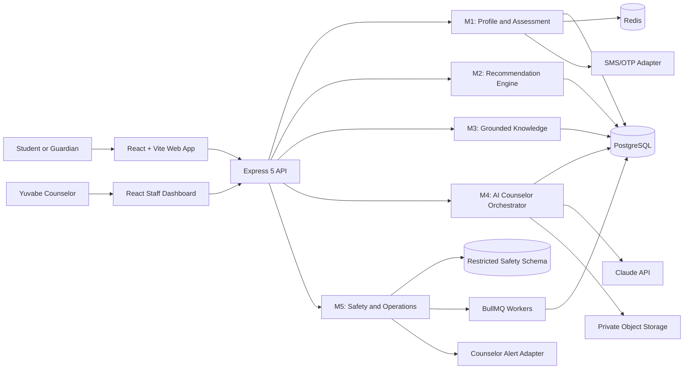

### Important boundaries

- The browser never talks directly to Claude, PostgreSQL, Redis, SMS, or storage.
- Claude never talks directly to PostgreSQL.
- All model-visible data passes through typed Express tools.
- Safety can interrupt Module 4 and the normal student journey.
- Module 2 can run with Claude completely disabled.

---

## 3. Module dependency workflow

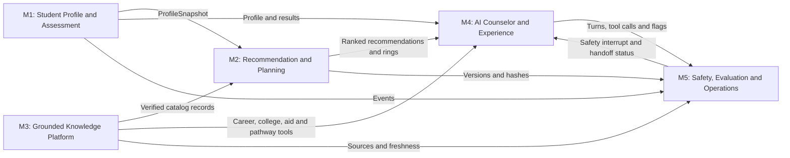

This is not a single pipeline of `assessment → recommendation → RAG → AI → evaluation`.

- Module 2 needs both Module 1 and Module 3.
- Module 4 can call Modules 1–3 depending on student intent.
- Module 5 evaluates and monitors every module.
- Evaluation is cross-cutting, not the final student-facing step.

---

## 4. Complete student journey

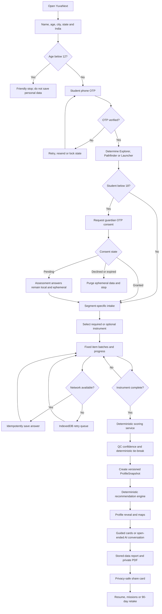

### Journey ownership

- Landing through `ProfileSnapshot`: Module 1.
- Recommendation computation: Module 2 using Module 3 data.
- Reveal, exploration, report, and share experience: Module 4.
- Safety, counselor visibility, audit, privacy jobs, and evaluation: Module 5.

---

## 5. Deterministic path versus AI path

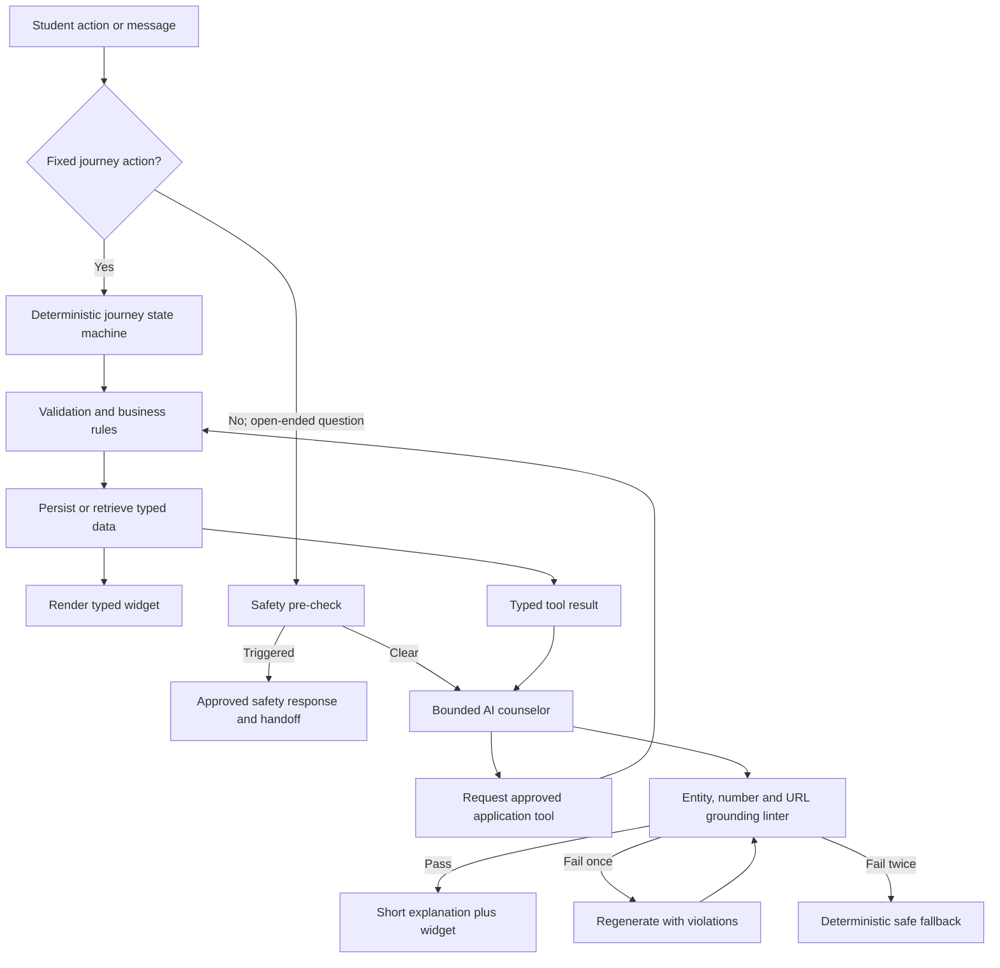

### Always deterministic

- OTP and account merging.
- Consent status and persistence permission.
- Segment routing.
- Intake question sequence.
- Assessment item selection and order.
- Response persistence and resume position.
- RIASEC/WIP/Big Five/photo/aptitude scoring.
- QC, confidence, and tie-breaking.
- Career, college, and scholarship ranking.
- Ring partitioning.
- Retake cooldown.
- Safety tier and approved safety copy.
- Data deletion and retention jobs.

### AI-assisted

- Interpreting free-text intent.
- Explaining a stored result in accessible language.
- Comparing retrieved options.
- Explaining direct and resilient routes.
- Answering “what if?” questions after a deterministic recalculation.
- Personalizing wording with approved intake facts.
- Optional wording polish for a deterministic summary.

---

## 6. AI counselor tool-use sequence

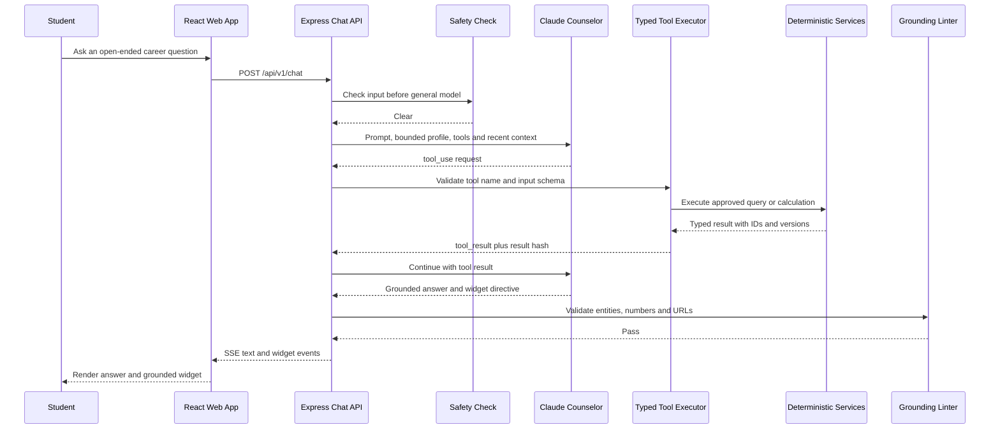

### Approved tool set

1. `get_profile`
2. `match_careers`
3. `get_career`
4. `get_streams`
5. `get_colleges`
6. `get_aid_schemes`
7. `request_handoff`

The POC should use a custom Express orchestration loop. A separate agent framework is unnecessary for seven stable tools and a bounded conversation.

---

## 7. Safety interrupt workflow

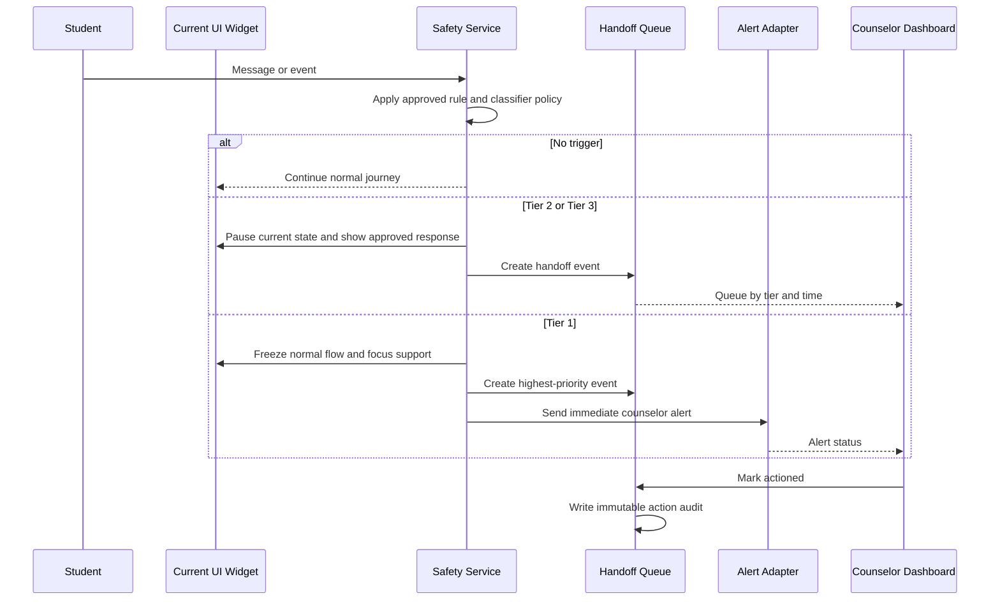

Claude does not write, rewrite, translate, or choose the approved safety response.

---

## 8. Recommendation workflow

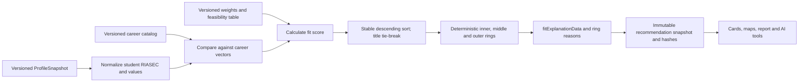

The LLM receives the saved recommendation output. It does not receive raw data and then invent a ranking.

---

## 9. Knowledge retrieval workflow

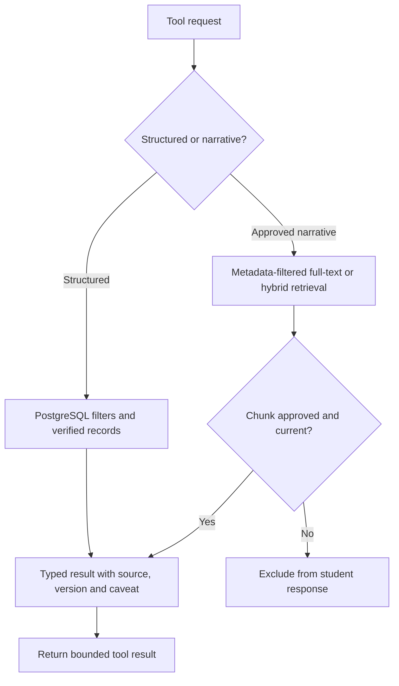

### RAG decision

- Do not use RAG for scores, vectors, salaries, fees, application links, eligibility fields, or entity identity.
- Start the POC with PostgreSQL structured queries and full-text search.
- Add vector retrieval only for approved narrative descriptions/FAQs if evaluation shows a real need.
- Structured data wins if narrative text conflicts with a structured field.

---

## 10. Failure and degradation workflow

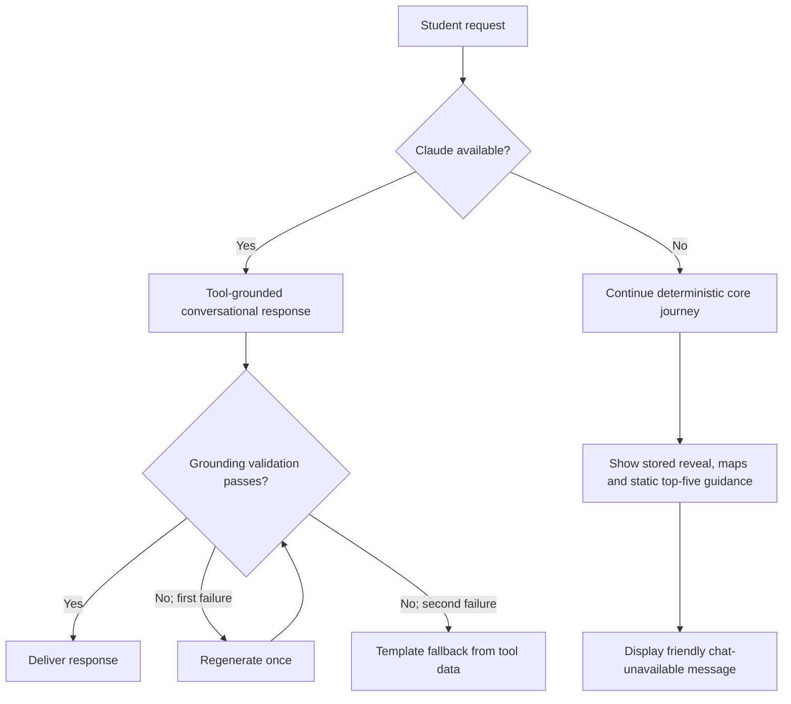

The following remain available without Claude:

- Authentication and consent.
- Intake and assessment.
- Scoring and result reveal.
- Career/college/aid matching.
- Ring maps and accessible lists.
- Stored report generation.
- Safety interrupts and counselor handoff.

---

## 11. Evaluation workflow

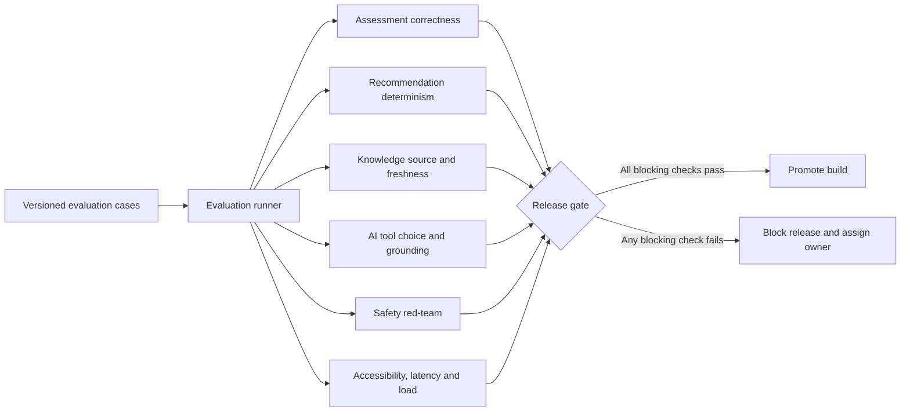

Evaluation is not another AI agent. It is a controlled set of fixtures, assertions, metrics, and reports. Model grading may support tone evaluation but cannot be the only judge for safety or deterministic correctness.

---

## 12. Why no multi-agent workflow in Phase 1

| Question                                      | YuvaNext answer                                             |
| --------------------------------------------- | ----------------------------------------------------------- |
| Are there several independent goals?          | No; one student journey with bounded exploration.           |
| Must different agents negotiate or debate?    | No. Deterministic services own facts.                       |
| Is long-running autonomous planning required? | No. Most responses should finish in one or two tool rounds. |
| Would specialized agents improve safety?      | Not by default; they add more model failure points.         |
| Is tool selection complex?                    | No; seven stable tools are manageable in one registry.      |
| Must actions be auditable?                    | Yes; a single orchestrator is easier to reconstruct.        |
| Must the app degrade without AI?              | Yes; multi-agent dependence would make this harder.         |

### Reconsider a workflow graph later only if

- A request reliably needs many dependent tool steps.
- Sessions require resumable long-running AI tasks.
- Tool count grows enough that selection quality drops.
- Counselors approve separate specialized prompt policies.
- Evaluation demonstrates measurable improvement over the simple tool loop.

Even then, introduce a state graph before introducing multiple autonomous personas.

---

## 13. Express request lifecycle

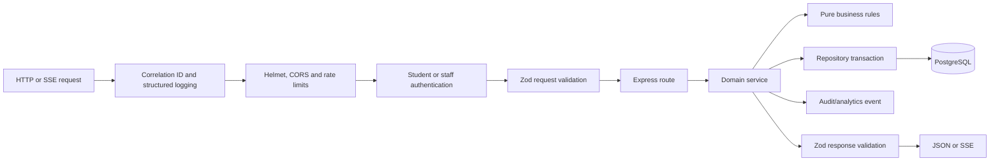

Express is the transport and middleware layer. It must not become a folder of route handlers containing scoring, SQL, and Claude calls together.

---

## 14. FigJam/Figma drawing specification

The primary FigJam board should have six left-to-right frames:

1. **Actors and Channels** — Student, Guardian, Counselor, React Web App.
2. **Deterministic Core** — Identity/Consent, Assessment/Scoring, Recommendation.
3. **Grounded Knowledge** — Catalog, retrieval tools, sources, freshness.
4. **Bounded AI Counselor** — Safety pre-check, Claude, tool executor, grounding linter.
5. **Outputs** — Chat, maps, report, share card, counselor queue.
6. **Cross-cutting Controls** — Safety, audit, privacy, evaluation, monitoring.

Suggested visual language:

- Blue: frontend and student journey.
- Green: deterministic business services.
- Purple: AI-only components.
- Amber: verified knowledge/data.
- Red: safety and restricted operations.
- Gray dashed arrows: evaluation/observability.

Every arrow should be labeled with a contract, such as `ProfileSnapshot`, `RecommendationSet`, `ToolResult`, `SafetyEvent`, or `WidgetDirective`.

Do not draw the system as five boxes in one straight line. The diagram must show:

- Module 3 feeding Modules 2 and 4.
- Module 1 feeding Modules 2 and 4.
- Module 5 surrounding/intercepting the runtime.
- Claude calling tools through Express rather than accessing the database.
- A no-Claude fallback path.

---

## 15. Final implementation rule

Use this rule during code review:

> If an operation must always produce the same answer from the same stored inputs, implement it as a deterministic TypeScript rule or database query. Use AI only when language understanding, explanation, or open-ended exploration adds value.

This boundary is the foundation of YuvaNext's reliability, safety, and auditability.
