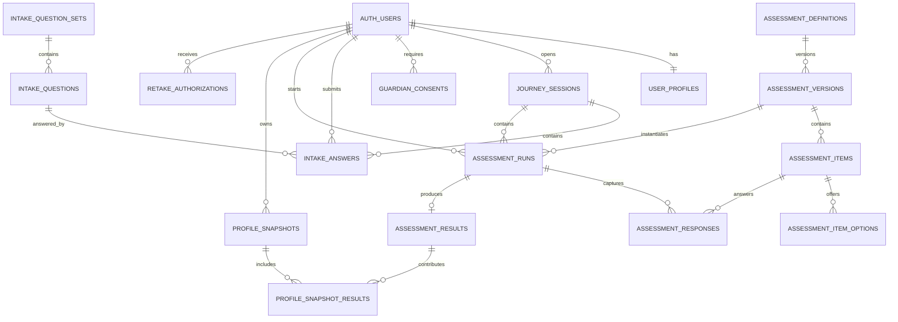

# Module 1 Data Model: Onboarding and Assessment

Companion implementation walkthrough: [Module 1 prototype-to-database storage flow](module-1-prototype-storage-flow.md).

## 1. Outcome and ownership

Module 1 owns the `assessment` PostgreSQL schema and produces an immutable, versioned `ProfileSnapshot`. It covers the application projection of a Supabase Auth student, guardian consent, segment routing, intake, assessment delivery, response persistence, deterministic scoring, resume and retake authorization.

It does not own career catalog records, recommendation rankings, conversations, reports, safety decisions or evaluation results.

## 2. Input and output boundary

### Inputs

| Operation                | Input                                                                  | Source                          |
| ------------------------ | ---------------------------------------------------------------------- | ------------------------------- |
| Create/update profile    | first name, age-at-onboarding, city, state, self stage, aid preference | Student after Auth verification |
| Request guardian consent | guardian phone, consent text version                                   | Minor onboarding flow           |
| Submit intake answer     | question ID/version, selected option                                   | Student                         |
| Start assessment         | instrument code/version, segment                                       | Student journey                 |
| Submit response          | run ID, item ID, typed response, latency, client answer ID             | Student assessment UI           |
| Score run                | completed assessment run ID                                            | Module 1 application service    |
| Authorize retake         | user/result, reason, staff actor                                       | Approved operational flow       |

### Primary output

```ts
type ProfileSnapshot = {
  snapshotId: string;
  userId: string;
  segment: "explorer" | "pathfinder" | "launcher";
  ageBand: string;
  city: string;
  stateCode: string;
  selfStage: string;
  wantsAid: boolean;
  intakeSummary: Record<string, unknown>;
  riasec?: {
    rawScores: Record<"R" | "I" | "A" | "S" | "E" | "C", number>;
    normalizedScores: Record<"R" | "I" | "A" | "S" | "E" | "C", number>;
    code: string;
    confidence: "normal" | "soft";
    closeScores: boolean;
    instrumentCode: string;
    instrumentVersion: string;
  };
  values?: Record<string, unknown>;
  bigFive?: Record<string, unknown>;
  aptitude?: Record<string, unknown>;
  profileVersion: number;
  algorithmVersion: string;
  sourceResultIds: string[];
  createdAt: string;
};
```

Consumers receive this DTO through an application port/API. They do not query raw responses.

## 3. Relationship overview



`AUTH_USERS` represents `auth.users`, which Supabase manages.

## 4. Table dictionary

### `assessment.user_profiles`

Application profile keyed to Supabase Auth. It contains no duplicate student phone.

| Column              | Type          | Rules                                                                       |
| ------------------- | ------------- | --------------------------------------------------------------------------- |
| `user_id`           | `uuid`        | PK, FK to `auth.users(id)` on delete cascade                                |
| `first_name`        | `text`        | Required after onboarding; trimmed; bounded length                          |
| `age_at_onboarding` | `smallint`    | Check `12..100`; under-12 flow creates no profile                           |
| `age_band`          | `text`        | Check approved bands; snapshot of routing input                             |
| `city`              | `text`        | Required, bounded                                                           |
| `state`             | `text`        | State/UT name as supplied by the user; no code conversion during onboarding |
| `country_code`      | `char(2)`     | Default `IN`                                                                |
| `segment`           | `text`        | `explorer`, `pathfinder`, `launcher`                                        |
| `self_stage`        | `text`        | Approved education-stage code                                               |
| `wants_aid`         | `boolean`     | Default false                                                               |
| `profile_status`    | `text`        | `active`, `deletion_pending`, `deleted`                                     |
| `created_at`        | `timestamptz` | Required                                                                    |
| `updated_at`        | `timestamptz` | Required                                                                    |
| `deleted_at`        | `timestamptz` | Nullable                                                                    |

Indexes: `(segment)`, `(state)`, partial index on active profiles only. State-name normalization for college/aid matching is a separate knowledge-layer concern.

### `assessment.anonymous_sessions`

Short-lived pre-auth journey record. It must not contain assessment responses or a plaintext phone.

| Column              | Type          | Rules                                      |
| ------------------- | ------------- | ------------------------------------------ |
| `id`                | `uuid`        | PK                                         |
| `public_token_hash` | `text`        | Unique; never store bearer token plaintext |
| `status`            | `text`        | `active`, `merged`, `expired`, `abandoned` |
| `merged_user_id`    | `uuid`        | Nullable FK to `auth.users`                |
| `started_at`        | `timestamptz` | Required                                   |
| `last_seen_at`      | `timestamptz` | Required                                   |
| `expires_at`        | `timestamptz` | Required                                   |
| `merged_at`         | `timestamptz` | Nullable                                   |

Index: unique `public_token_hash`; expiry index for cleanup.

Pre-auth name/age/location values remain in client memory or an approved short-lived server challenge/session store. For a minor, the durable `user_profiles` row is finalized only after guardian consent; `anonymous_sessions` itself remains non-PII.

### `assessment.journey_sessions`

Product journey session, separate from the Supabase Auth session/token.

| Column                 | Type          | Rules                                                   |
| ---------------------- | ------------- | ------------------------------------------------------- |
| `id`                   | `uuid`        | PK                                                      |
| `user_id`              | `uuid`        | FK to `auth.users`                                      |
| `anonymous_session_id` | `uuid`        | Nullable FK for merge trace                             |
| `channel`              | `text`        | Phase A `web`                                           |
| `status`               | `text`        | `active`, `paused`, `completed`, `expired`, `abandoned` |
| `started_at`           | `timestamptz` | Required                                                |
| `last_seen_at`         | `timestamptz` | Required                                                |
| `expires_at`           | `timestamptz` | Required                                                |
| `completed_at`         | `timestamptz` | Nullable                                                |

This table contains no refresh token or Supabase Auth credential. Index active sessions by `(user_id, last_seen_at desc)`.

### `assessment.guardian_consents`

Consent ledger. The contactable guardian number is not retained in Phase A.

| Column                    | Type          | Rules                                                        |
| ------------------------- | ------------- | ------------------------------------------------------------ |
| `id`                      | `uuid`        | PK                                                           |
| `user_id`                 | `uuid`        | FK to `auth.users`; required                                 |
| `consent_type`            | `text`        | `guardian` for minors; self consent can be added if required |
| `guardian_phone_hash`     | `text`        | Required; keyed hash recommended                             |
| `guardian_phone_last4`    | `char(4)`     | Masked staff display only                                    |
| `status`                  | `text`        | `pending`, `granted`, `declined`, `expired`, `revoked`       |
| `text_version`            | `text`        | Required                                                     |
| `requested_at`            | `timestamptz` | Required                                                     |
| `verified_at`             | `timestamptz` | Nullable                                                     |
| `declined_at`             | `timestamptz` | Nullable                                                     |
| `expired_at`              | `timestamptz` | Nullable                                                     |
| `revoked_at`              | `timestamptz` | Nullable                                                     |
| `provider_reference_hash` | `text`        | Nullable; no provider payload                                |
| `created_at`              | `timestamptz` | Required                                                     |

Constraints:

- Only one active pending/granted guardian consent per student/text version.
- Guardian phone hash must differ from a derived student-phone comparison performed by the Auth/consent service.
- Status timestamps must agree with status.

The normalized contactable number exists only in a TTL challenge store during OTP verification. It is not a persistent PostgreSQL column in Phase A.

### `assessment.intake_question_sets`

| Column           | Type          | Rules                          |
| ---------------- | ------------- | ------------------------------ |
| `id`             | `uuid`        | PK                             |
| `segment`        | `text`        | Approved segment               |
| `version`        | `text`        | Unique with segment            |
| `language`       | `text`        | Phase A `en`                   |
| `status`         | `text`        | `draft`, `approved`, `retired` |
| `effective_from` | `timestamptz` | Required for approved set      |
| `retired_at`     | `timestamptz` | Nullable                       |
| `created_at`     | `timestamptz` | Required                       |

Constraint: approved question counts are Explorer 5, Pathfinder 7, Launcher 9, verified by seed/contract tests.

### `assessment.intake_questions`

| Column            | Type       | Rules                                         |
| ----------------- | ---------- | --------------------------------------------- |
| `id`              | `uuid`     | PK                                            |
| `question_set_id` | `uuid`     | FK; required                                  |
| `question_key`    | `text`     | Stable semantic key                           |
| `display_order`   | `smallint` | Positive; unique within set                   |
| `prompt_text`     | `text`     | Approved text                                 |
| `response_type`   | `text`     | `single_choice`, `multi_choice`, `short_text` |
| `options_json`    | `jsonb`    | Zod-validated bounded options                 |
| `is_sensitive`    | `boolean`  | Controls logging/display                      |
| `is_required`     | `boolean`  | Required                                      |

Free-text is allowed only for explicitly approved fields and must be bounded.

### `assessment.intake_answers`

| Column                 | Type          | Rules                               |
| ---------------------- | ------------- | ----------------------------------- |
| `id`                   | `uuid`        | PK                                  |
| `user_id`              | `uuid`        | FK to Auth user                     |
| `session_id`           | `uuid`        | FK to `assessment.journey_sessions` |
| `question_id`          | `uuid`        | FK                                  |
| `question_set_version` | `text`        | Denormalized audit value            |
| `answer_json`          | `jsonb`       | Zod-validated typed answer          |
| `answered_at`          | `timestamptz` | Required                            |

Unique: `(user_id, session_id, question_id)`. Updates before intake completion replace the answer transactionally; completed intake is snapshotted and not silently rewritten.

### `assessment.assessment_definitions`

One stable instrument identity.

| Column            | Type          | Rules                                                                     |
| ----------------- | ------------- | ------------------------------------------------------------------------- |
| `id`              | `uuid`        | PK                                                                        |
| `instrument_code` | `text`        | Unique: `ip_60`, `mini_ip_30`, `photo_ip`, `wip`, `mini_ipip`, `aptitude` |
| `name`            | `text`        | Required                                                                  |
| `construct`       | `text`        | `interest`, `work_values`, `big_five`, `aptitude`                         |
| `status`          | `text`        | `active`, `inactive`                                                      |
| `created_at`      | `timestamptz` | Required                                                                  |

### `assessment.assessment_versions`

| Column                      | Type          | Rules                                  |
| --------------------------- | ------------- | -------------------------------------- |
| `id`                        | `uuid`        | PK                                     |
| `definition_id`             | `uuid`        | FK                                     |
| `version`                   | `text`        | Unique within definition               |
| `language`                  | `text`        | `en`; future reviewed languages        |
| `age_min`                   | `smallint`    | Nullable                               |
| `age_max`                   | `smallint`    | Nullable                               |
| `item_count`                | `smallint`    | Required                               |
| `batch_size`                | `smallint`    | Explorer 5, otherwise 10 as configured |
| `scoring_algorithm_version` | `text`        | Required                               |
| `content_license_ref`       | `text`        | Required before production approval    |
| `review_status`             | `text`        | `mock`, `draft`, `approved`, `retired` |
| `effective_from`            | `timestamptz` | Nullable                               |
| `retired_at`                | `timestamptz` | Nullable                               |
| `created_at`                | `timestamptz` | Required                               |

Only one approved active version per instrument/language/age range at a time.

### `assessment.assessment_items`

| Column                  | Type          | Rules                                                |
| ----------------------- | ------------- | ---------------------------------------------------- |
| `id`                    | `uuid`        | PK                                                   |
| `assessment_version_id` | `uuid`        | FK                                                   |
| `item_key`              | `text`        | Unique within version                                |
| `display_order`         | `smallint`    | Unique within version                                |
| `item_type`             | `text`        | `likert`, `photo_pair`, `forced_choice`, `mcq`, `qc` |
| `prompt_text`           | `text`        | Approved/mock content                                |
| `prompt_asset_ref`      | `text`        | Nullable storage/catalog reference                   |
| `scale_code`            | `text`        | RIASEC/value/trait/subtype; nullable for QC          |
| `is_reverse_scored`     | `boolean`     | Default false                                        |
| `is_qc`                 | `boolean`     | Default false                                        |
| `qc_rule_json`          | `jsonb`       | Nullable; typed/versioned                            |
| `is_tie_break`          | `boolean`     | Default false                                        |
| `review_status`         | `text`        | `mock`, `draft`, `approved`, `retired`               |
| `created_at`            | `timestamptz` | Required                                             |

Production checks ensure the correct number of scored items per scale. Mock Phase A items must remain marked `mock`.

### `assessment.assessment_item_options`

Supports photo pairs, forced choice and MCQs without overloading the item row.

| Column                  | Type       | Rules                                   |
| ----------------------- | ---------- | --------------------------------------- |
| `id`                    | `uuid`     | PK                                      |
| `item_id`               | `uuid`     | FK                                      |
| `option_key`            | `text`     | Unique within item                      |
| `display_order`         | `smallint` | Required                                |
| `label_text`            | `text`     | Nullable for image-only choice          |
| `asset_ref`             | `text`     | Nullable                                |
| `score_scale_code`      | `text`     | Nullable                                |
| `score_delta`           | `numeric`  | Nullable; e.g. photo choice `+2`        |
| `is_correct`            | `boolean`  | Nullable; restricted for aptitude items |
| `scoring_metadata_json` | `jsonb`    | Typed; nullable                         |

Correct-answer fields must not be returned by student item-delivery APIs.

### `assessment.assessment_runs`

| Column                  | Type          | Rules                                                             |
| ----------------------- | ------------- | ----------------------------------------------------------------- |
| `id`                    | `uuid`        | PK                                                                |
| `user_id`               | `uuid`        | FK to Auth user                                                   |
| `journey_session_id`    | `uuid`        | FK to `assessment.journey_sessions`                               |
| `assessment_version_id` | `uuid`        | FK; frozen at start                                               |
| `segment`               | `text`        | Snapshot at start                                                 |
| `status`                | `text`        | `created`, `active`, `paused`, `completed`, `scored`, `abandoned` |
| `current_position`      | `smallint`    | Non-negative                                                      |
| `started_at`            | `timestamptz` | Required                                                          |
| `last_answered_at`      | `timestamptz` | Nullable                                                          |
| `completed_at`          | `timestamptz` | Nullable                                                          |
| `scored_at`             | `timestamptz` | Nullable                                                          |
| `resume_expires_at`     | `timestamptz` | Start/last activity plus 14-day rule                              |
| `attempt_number`        | `smallint`    | Positive                                                          |
| `created_at`            | `timestamptz` | Required                                                          |

Unique active-run rule prevents two simultaneous runs of the same instrument version for one user unless explicitly supported.

### `assessment.assessment_responses`

| Column               | Type          | Rules                                        |
| -------------------- | ------------- | -------------------------------------------- |
| `id`                 | `uuid`        | PK                                           |
| `assessment_run_id`  | `uuid`        | FK; required                                 |
| `item_id`            | `uuid`        | FK; required                                 |
| `selected_option_id` | `uuid`        | Nullable FK                                  |
| `response_value`     | `smallint`    | Nullable; check `1..5` for Likert            |
| `response_json`      | `jsonb`       | Nullable; only for approved structured types |
| `latency_ms`         | `integer`     | Non-negative, capped                         |
| `answered_at`        | `timestamptz` | Required                                     |
| `received_at`        | `timestamptz` | Required                                     |

Constraints:

- Unique `(assessment_run_id, item_id)`.
- Exactly one valid response representation for the item's type.
- Item must belong to the run's frozen assessment version.
- Responses are accepted only for `active` runs and consented minors.

Indexes: `(assessment_run_id, answered_at)`.

### `assessment.assessment_results`

Immutable deterministic result for one run.

| Column                   | Type          | Rules                                  |
| ------------------------ | ------------- | -------------------------------------- |
| `id`                     | `uuid`        | PK                                     |
| `assessment_run_id`      | `uuid`        | Unique FK                              |
| `user_id`                | `uuid`        | FK; denormalized for authorized lookup |
| `instrument_code`        | `text`        | Required                               |
| `instrument_version`     | `text`        | Required                               |
| `algorithm_version`      | `text`        | Required                               |
| `raw_scores_json`        | `jsonb`       | Zod-validated                          |
| `normalized_scores_json` | `jsonb`       | Zod-validated, nullable by construct   |
| `result_code`            | `text`        | Holland code where applicable          |
| `confidence`             | `text`        | `normal`, `soft`                       |
| `close_scores`           | `boolean`     | Default false                          |
| `qc_summary_json`        | `jsonb`       | Restricted bounded summary             |
| `input_hash`             | `text`        | Required                               |
| `output_hash`            | `text`        | Required                               |
| `created_at`             | `timestamptz` | Required                               |

The result row is never updated to reflect a new algorithm. A new run/result is created.

### `assessment.profile_snapshots`

Immutable handoff object aggregating the student's completed intake/results at a point in time.

| Column                    | Type          | Rules                                                      |
| ------------------------- | ------------- | ---------------------------------------------------------- |
| `id`                      | `uuid`        | PK                                                         |
| `user_id`                 | `uuid`        | FK                                                         |
| `profile_version`         | `integer`     | Increasing per user                                        |
| `segment`                 | `text`        | Required                                                   |
| `age_band`                | `text`        | Required                                                   |
| `city`                    | `text`        | Required                                                   |
| `state`                   | `text`        | Required full-text state/UT value captured in the snapshot |
| `self_stage`              | `text`        | Required                                                   |
| `wants_aid`               | `boolean`     | Required                                                   |
| `intake_summary_json`     | `jsonb`       | Versioned DTO                                              |
| `result_summary_json`     | `jsonb`       | Versioned DTO                                              |
| `algorithm_version`       | `text`        | Required                                                   |
| `snapshot_schema_version` | `integer`     | Required                                                   |
| `payload_hash`            | `text`        | Required                                                   |
| `created_at`              | `timestamptz` | Required                                                   |

Unique `(user_id, profile_version)`. Consumers reference the snapshot ID and must not silently substitute a newer snapshot.

### `assessment.profile_snapshot_results`

Relational membership between an immutable profile snapshot and its source results.

| Column                 | Type       | Rules                                        |
| ---------------------- | ---------- | -------------------------------------------- |
| `profile_snapshot_id`  | `uuid`     | FK to profile snapshot                       |
| `assessment_result_id` | `uuid`     | FK to assessment result                      |
| `result_role`          | `text`     | `interest`, `values`, `big_five`, `aptitude` |
| `display_order`        | `smallint` | Positive                                     |

PK: `(profile_snapshot_id, assessment_result_id)`. Unique `(profile_snapshot_id, result_role)` unless the approved profile contract later supports multiple results of one construct.

### `assessment.retake_authorizations`

| Column               | Type          | Rules              |
| -------------------- | ------------- | ------------------ |
| `id`                 | `uuid`        | PK                 |
| `user_id`            | `uuid`        | FK                 |
| `previous_result_id` | `uuid`        | FK                 |
| `reason_code`        | `text`        | Approved code      |
| `approved_by`        | `uuid`        | Staff Auth user ID |
| `approved_at`        | `timestamptz` | Required           |
| `expires_at`         | `timestamptz` | Required           |
| `used_at`            | `timestamptz` | Nullable           |

Phase 1 counselor UI remains read-only unless an approved operational workflow explicitly owns this action.

## 5. State transitions

### Guardian consent

```text
pending → granted
pending → declined
pending → expired
granted → revoked
```

No transition leaves `declined`, `expired` or `revoked`; a new request creates a new record.

### Assessment run

```text
created → active → paused → active
                  ├────────→ completed → scored
                  └────────→ abandoned
```

Phase A does not start intake/assessment for a minor until consent is `granted`.

## 6. Input-to-storage-to-output matrix

| Use case            | Validated input               | Writes                               | Output                    |
| ------------------- | ----------------------------- | ------------------------------------ | ------------------------- |
| Complete onboarding | profile fields                | `user_profiles`                      | User profile DTO          |
| Verify guardian     | OTP result/text version       | `guardian_consents`                  | Consent status            |
| Submit intake       | question/version/answer       | `intake_answers`                     | Intake progress           |
| Start run           | instrument/version            | `assessment_runs`                    | Run/first batch           |
| Answer item         | run/item/response/idempotency | `assessment_responses`, run progress | Saved response/next batch |
| Score               | completed run                 | `assessment_results`                 | Instrument result         |
| Build profile       | completed results/intake      | `profile_snapshots`                  | `ProfileSnapshot`         |

## 7. Access and privacy

- Student may access only their own profile, consent status, runs, results and snapshots through Express.
- Raw assessment answers are not returned to Module 2/4 or general staff lists.
- Guardian phone hash/last four are available only to the consent service and explicitly authorized staff view.
- Correct aptitude answers and scoring keys are backend-only.
- General analytics receives counts, durations, segment and instrument—not answer content.
- No assessment response exists before guardian consent in Phase A.

## 8. Retention and deletion

| Data                        | Phase A behavior                                                       |
| --------------------------- | ---------------------------------------------------------------------- |
| Anonymous session           | Delete after expiry/merge cleanup window                               |
| Guardian OTP challenge      | TTL store; delete on completion/expiry                                 |
| Consent ledger              | Retain per approved consent/audit policy                               |
| Responses/results/snapshots | Delete through privacy job unless approved exception applies           |
| Retired instrument content  | Retain version metadata/content needed to reproduce historical results |
| Mock fixtures               | Non-personal; version in repository                                    |

Exact durations remain a privacy-policy decision.

## 9. Migration slices

```text
m1_001_schema_profiles_consent
m1_002_journey_sessions_intake
m1_003_assessment_catalog
m1_004_runs_responses
m1_005_results_snapshots_membership
m1_006_retake_and_constraints
m1_007_indexes_and_privileges
```

## 10. Required tests

- Under-12 path creates no profile.
- Guardian/student phone equivalence is rejected by service logic.
- Pending/declined consent cannot start a minor assessment.
- Duplicate client answer/run-item submission creates one response.
- Item from another instrument version is rejected.
- Resume returns the exact next item within 14 days.
- Completed responses cannot be silently edited.
- TV-1 through TV-5 produce exact outputs.
- Snapshot hash is stable for identical validated inputs.
- Deleting a student removes normal access and schedules hard deletion.

## 11. Open decisions

| Decision                                                | Status                 |
| ------------------------------------------------------- | ---------------------- |
| Production assessment item bank and license metadata    | Open P0                |
| Approved tie-break items/mapping                        | Open P0                |
| Exact age-band codes and whether age is refreshed later | Proposed               |
| Consent-record retention duration                       | Privacy review         |
| Whether guardian re-contact is ever required            | Product/privacy review |
| Staff workflow allowed to authorize retake              | Product decision       |

## 12. Module-ready criteria

- Zod contracts match every public input/output.
- Clean Supabase migration and seed succeed.
- Consent/run state transitions are enforced in service and tested.
- Response idempotency and version membership constraints pass.
- Test vectors pass without AI calls.
- ProfileSnapshot is consumable without importing Module 1 repositories.
- No phone, OTP, free-text answer or scoring key appears in logs.
