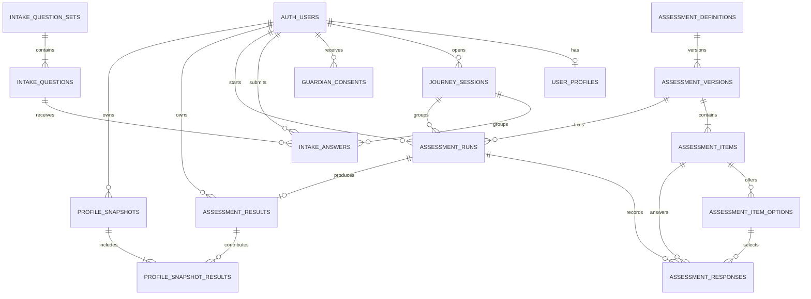

# Module 1 Prototype-to-Database Storage Flow

## 1. Purpose

This document explains how the onboarding and assessment journey demonstrated in `YuvaNext_Prototype.html` maps to the Phase A backend and Supabase data model.

Use it to answer:

- What happens after each chat question?
- Is the value temporary or durable?
- Which PostgreSQL table stores it?
- What does an example row look like?
- How do Module 1 records connect to Supabase `auth.users`?
- What does Module 1 hand to Recommendation and AI Counselor modules?

Related sources:

- [HTML prototype](../../YuvaNext_Prototype.html)
- [Module 1 target data model](module-1-assessment-data-model.md)
- [Module 1 MVP DBML](module-1-assessment-mvp.dbml)
- [Phase A MVP data model](phase-a-mvp-data-model.md)

The HTML file is a concept prototype and states that it stores no real data. The flow below describes how the real React + Express + Supabase implementation should persist the same journey.

## 2. One database and two relevant schemas

Module 1 does not use a separate database. It uses the shared YuvaNext Supabase PostgreSQL database.

```text
YuvaNext Supabase project
├── auth.users                     Supabase-managed login identity
└── assessment.*                   Module 1 application tables
```

Important distinction:

```text
auth.users
    = Who is authenticated?

assessment.user_profiles
    = What student information does YuvaNext need?

assessment.journey_sessions
    = Which product journey is currently happening?
```

The React frontend must not write these domain tables directly. React calls Express, Express validates the Supabase JWT and business rules, and the Module 1 repository writes PostgreSQL.

## 3. Example student used throughout this document

```text
Name: Anandi
Age: 14
City: Auroville
State: Tamil Nadu
Country: India
Education stage: School / Class 8
Calculated segment: Explorer
Guardian consent: Required
Assessment: Mini Interest Profiler
Result: IAS
```

Example IDs are shortened for readability:

```text
auth user               usr-anandi
student session         ses-001
consent                  con-001
intake question set      iqs-explorer-v1
assessment version       av-mini-ip-v1
assessment run           run-001
assessment result        res-001
profile snapshot         ps-001
```

Production IDs are UUIDs.

## 4. Complete prototype-to-storage overview

| Prototype step        | Example input/action                   | Temporary location               | Durable location                                              |
| --------------------- | -------------------------------------- | -------------------------------- | ------------------------------------------------------------- |
| Welcome               | Chat opens                             | React state                      | No database write                                             |
| Basic details         | Anandi, 14, Auroville, Tamil Nadu      | Frontend onboarding draft        | `assessment.user_profiles` after persistence is permitted     |
| Phone OTP             | Student phone and OTP                  | Supabase Auth/provider challenge | `auth.users`; no duplicate phone in Assessment                |
| Journey starts        | OTP verified                           | —                                | `assessment.journey_sessions`                                 |
| Minor consent         | Guardian verification                  | OTP/provider TTL state           | `assessment.guardian_consents`                                |
| Intake questions load | Explorer intake v1                     | React UI                         | Read from `intake_question_sets` and `intake_questions`       |
| Intake answer         | Favourite subject = Science            | React request state              | `assessment.intake_answers` after consent                     |
| Assessment loads      | Mini-IP v1                             | React UI                         | Read definition/version/items/options                         |
| Assessment starts     | First question displayed               | —                                | `assessment.assessment_runs`                                  |
| Student answers       | Like/Love activity                     | Pending request/offline queue    | `assessment.assessment_responses` after consent               |
| Scoring               | All required responses complete        | Express scoring process          | `assessment.assessment_results`                               |
| Profile handoff       | Combine profile, intake and results    | Express application service      | `assessment.profile_snapshots` and `profile_snapshot_results` |
| Recommendations       | Generate career/stream/pathway results | Module 2                         | Module 2 tables reference `profile_snapshot_id`               |
| AI explanation        | Explain stored results                 | Module 4                         | AI cannot change Module 1 scores or snapshots                 |

## 5. Step 1: chat asks for name, age, city and state

The prototype asks:

```text
What should I call you?
How old are you?
Which city or town do you live in?
Which state?
```

Before authentication, React holds a temporary draft:

```ts
type OnboardingDraft = {
  firstName: "Anandi";
  age: 14;
  city: "Auroville";
  stateCode: "TN";
  countryCode: "IN";
  selfStage: "school";
};
```

### MVP storage decision

`assessment.anonymous_sessions` is deferred. Therefore, the pre-auth draft is not written to PostgreSQL.

Recommended frontend handling:

```text
React state
    └── optionally sessionStorage with a short expiry
```

Do not use long-lived `localStorage` for student PII. Clear the draft after successful persistence, logout, consent decline or expiry.

At this stage:

```text
auth.users                              no row yet
assessment.user_profiles             no row yet
assessment.journey_sessions             no row yet
```

## 6. Step 2: phone OTP creates the authenticated identity

The prototype requests a phone number and simulates OTP verification.

Real flow:

```text
React
  → Supabase phone OTP
  → student enters OTP
  → Supabase verifies
  → auth.users row exists
  → React receives authenticated session/JWT
```

Example Supabase-owned identity:

```text
auth.users
┌──────────────────────────────────────┐
│ id            usr-anandi             │
│ phone         managed by Supabase    │
│ created_at    2026-07-24T...Z        │
└──────────────────────────────────────┘
```

The Assessment schema stores only `auth.users.id` as `user_id`. It does not copy the student's phone number.

## 7. Step 3: create the product journey session

After authentication, Express creates a YuvaNext product session.

### Table: `assessment.journey_sessions`

```text
id                    ses-001
user_id               usr-anandi
anonymous_session_id  null
channel               web
status                active
started_at            2026-07-24T07:00:00Z
last_seen_at          2026-07-24T07:00:00Z
expires_at            2026-07-31T07:00:00Z
completed_at          null
```

Relationship:

```text
auth.users
    1
    └──── many assessment.journey_sessions
```

This is not a Supabase Auth session and stores no access/refresh token. It groups intake answers and assessment runs for one product journey.

## 8. Step 4: calculate the segment

Express calculates the student segment from validated age and education-stage inputs.

```text
age = 14
self stage = school
        ↓
segment = explorer
```

The frontend cannot choose or override the persisted segment.

Segment affects:

- Guardian-consent requirement
- Intake-question set
- Assessment instrument/version
- Recommendation experience
- Report language and framing

The routing-rule version must be captured in application configuration/tests. Age is declared age, not inferred date of birth.

## 9. Step 5: guardian consent for a minor

Anandi is under 18, so guardian consent is required before durable student answers are stored.

### Table: `assessment.guardian_consents`

Example pending row:

```text
id                         con-001
user_id                    usr-anandi
consent_type               guardian
guardian_phone_hash        HMAC(...)
guardian_phone_last4       4321
status                     pending
text_version               guardian-consent-v1
requested_at               2026-07-24T07:02:00Z
verified_at                null
declined_at                null
expired_at                 null
revoked_at                 null
provider_reference_hash    HMAC(provider-reference)
created_at                 2026-07-24T07:02:00Z
```

After approval:

```text
status        granted
verified_at   2026-07-24T07:04:00Z
```

Relationship:

```text
auth.users
    1
    └──── many assessment.guardian_consents
```

The normalized guardian phone exists only in the OTP/provider challenge with a short TTL. The contactable number is not stored in PostgreSQL.

### Pending-consent behaviour

The prototype permits an ephemeral continuation. The database invariant is:

> No minor intake answer or assessment response is inserted into Supabase before valid guardian consent.

Two UI behaviours are possible:

```text
Option A: block intake/assessment until approval

Option B: let the student continue client-only
          and keep pending answers in expiring IndexedDB
```

If Option B is selected, approval triggers server revalidation before the queued records are persisted. Decline/expiry/logout deletes the browser queue. The final product choice remains a consent-flow freeze point; the database invariant is unchanged.

## 10. Step 6: create the student profile

Once authentication and the applicable consent gate permit persistence, Express writes the onboarding draft.

### Table: `assessment.user_profiles`

```text
user_id              usr-anandi
first_name           Anandi
age_at_onboarding    14
age_band             minor_14_15
city                 Auroville
state           Tamil Nadu
country_code         IN
segment              explorer
self_stage           school
wants_aid            false
profile_status       active
created_at           2026-07-24T07:04:10Z
updated_at           2026-07-24T07:04:10Z
deleted_at           null
```

Relationship:

```text
auth.users
    1
    └──── zero or one assessment.user_profiles
```

`user_id` is both the primary key and a foreign key to `auth.users.id`.

This answers where prototype values are stored:

| Prototype value        | Column                                        |
| ---------------------- | --------------------------------------------- |
| Anandi                 | `user_profiles.first_name`                    |
| 14                     | `user_profiles.age_at_onboarding`             |
| Calculated age band    | `user_profiles.age_band`                      |
| Auroville              | `user_profiles.city`                          |
| Tamil Nadu             | `user_profiles.state = "Tamil Nadu"`          |
| India                  | `user_profiles.country_code = IN`             |
| Explorer               | `user_profiles.segment`                       |
| School/Class 8 context | `user_profiles.self_stage` plus intake answer |
| Wants aid              | `user_profiles.wants_aid`                     |

The profile stores current student facts. It does not store assessment responses, scores, recommendations or chat messages.

## 11. Step 7: load segment-specific intake questions

Question definitions are shared content seeded before students use the application.

### Table: `assessment.intake_question_sets`

```text
id                iqs-explorer-v1
segment           explorer
version           1.0
language          en
status            approved
effective_from    2026-07-01T00:00:00Z
retired_at        null
created_at        2026-06-20T00:00:00Z
```

### Table: `assessment.intake_questions`

Example question:

```text
id                 iq-favourite-subject
question_set_id    iqs-explorer-v1
question_key       favourite_subject
display_order      2
prompt_text        Which subject do you enjoy most?
response_type      single_choice
options_json       ["science", "maths", "english", "art"]
is_sensitive       false
is_required        true
```

Relationship:

```text
intake_question_sets
    1
    └──── many intake_questions
```

Explorer, Pathfinder and Launcher have different versioned question sets.

## 12. Step 8: store intake answers

After consent permits persistence, each answer is written with its session and exact question version.

### Table: `assessment.intake_answers`

```text
id                     ia-001
user_id                usr-anandi
session_id             ses-001
question_id            iq-favourite-subject
question_set_version   1.0
answer_json             { "option": "science" }
answered_at            2026-07-24T07:05:00Z
```

Relationships:

```text
auth.users                  1 ──── many intake_answers
journey_sessions            1 ──── many intake_answers
intake_questions            1 ──── many intake_answers
```

Example Explorer intake rows:

```text
school_board       → CBSE
favourite_subject  → Science
flow_activity      → YouTube science videos
```

Unique ownership is enforced per user/session/question so retries do not create duplicate answers.

## 13. Step 9: load the assessment definition and version

Assessment reference content is shared and seeded before the journey.

### Table: `assessment.assessment_definitions`

```text
id                 ad-mini-ip
instrument_code    MINI_IP_30
name               Mini Interest Profiler
construct          riasec_interest
status             active
created_at         2026-06-01T00:00:00Z
```

### Table: `assessment.assessment_versions`

```text
id                          av-mini-ip-v1
definition_id               ad-mini-ip
version                     1.0
language                    en
age_min                     13
age_max                     15
item_count                  30
batch_size                  6
scoring_algorithm_version   riasec-score-v1
content_license_ref         approved-source-reference
review_status               approved
effective_from              2026-07-01T00:00:00Z
retired_at                  null
created_at                  2026-06-20T00:00:00Z
```

Relationship:

```text
assessment_definitions
    1
    └──── many assessment_versions
```

Historical runs remain connected to the exact version used at that time.

The prototype uses a 12-item mock quiz. Production Mini-IP-30/IP-60 content must come from an approved licensed/reviewed instrument source and test vectors.

## 14. Step 10: load assessment questions and options

### Table: `assessment.assessment_items`

```text
id                       item-r-01
assessment_version_id    av-mini-ip-v1
item_key                 MINI_IP_R_01
display_order            1
item_type                likert
prompt_text              Fix a bicycle that is not working
prompt_asset_ref         null
scale_code               R
is_reverse_scored        false
is_qc                    false
qc_rule_json             null
is_tie_break             false
review_status            approved
created_at               2026-06-20T00:00:00Z
```

### Table: `assessment.assessment_item_options`

Example option row:

```text
id                      opt-r-01-love
item_id                 item-r-01
option_key              love
display_order           5
label_text              Love it
asset_ref               null
score_scale_code        R
score_delta             5
is_correct              null
scoring_metadata_json   {}
```

Relationships:

```text
assessment_versions
    1
    └──── many assessment_items

assessment_items
    1
    └──── many assessment_item_options
```

The frontend receives only active/approved fields through Express.

## 15. Step 11: start an assessment run

When the student starts the instrument, Express creates one attempt.

### Table: `assessment.assessment_runs`

```text
id                       run-001
user_id                  usr-anandi
journey_session_id       ses-001
assessment_version_id    av-mini-ip-v1
segment                  explorer
status                   active
current_position         0
started_at               2026-07-24T07:06:00Z
last_answered_at         null
completed_at             null
scored_at                null
resume_expires_at        2026-07-31T07:06:00Z
attempt_number           1
created_at               2026-07-24T07:06:00Z
```

Relationships:

```text
auth.users              1 ──── many assessment_runs
journey_sessions        1 ──── many assessment_runs
assessment_versions     1 ──── many assessment_runs
```

The run makes resume, attempt limits and deterministic replay possible.

## 16. Step 12: persist each assessment response

The prototype updates an in-memory score as the student taps an option. In production, that browser score is only visual feedback; the backend result is calculated from validated stored responses.

### Table: `assessment.assessment_responses`

```text
id                    ar-001
assessment_run_id     run-001
item_id               item-r-01
selected_option_id    opt-r-01-love
response_value        5
response_json         null
latency_ms            2400
answered_at           2026-07-24T07:06:20Z
received_at           2026-07-24T07:06:21Z
```

Relationships:

```text
assessment_runs          1 ──── many assessment_responses
assessment_items         1 ──── many assessment_responses
assessment_item_options  1 ──── many assessment_responses
```

Important constraints:

```text
one response per assessment run + item
selected option must belong to the item
item must belong to the run's assessment version
```

The last two integrity rules require database/application contract tests in addition to foreign keys.

## 17. Step 13: deterministic scoring creates the result

After all required answers are present:

```text
assessment_responses
  → deterministic scoring service
  → assessment_results
```

The scoring service:

1. Loads the run and exact assessment version.
2. Validates item completeness and option membership.
3. Calculates raw R/I/A/S/E/C scores.
4. Normalizes the scores using the approved algorithm.
5. Applies the frozen tie-breaking rule.
6. Calculates result code, confidence and QC information.
7. Hashes input and output for replay.
8. Writes one immutable result.

### Table: `assessment.assessment_results`

```text
id                       res-001
assessment_run_id        run-001
user_id                  usr-anandi
instrument_code          MINI_IP_30
instrument_version       1.0
algorithm_version        riasec-score-v1
raw_scores_json          { "R": 14, "I": 22, "A": 18, "S": 16, "E": 11, "C": 13 }
normalized_scores_json   { "R": 0.45, "I": 0.82, "A": 0.64, "S": 0.55, "E": 0.31, "C": 0.40 }
result_code              IAS
confidence               normal
close_scores             false
qc_summary_json          { "passed": true }
input_hash               sha256(...)
output_hash              sha256(...)
created_at               2026-07-24T07:15:00Z
```

Relationship:

```text
assessment_runs
    1
    └──── zero or one assessment_results
```

AI does not calculate or modify this result.

## 18. Step 14: create the immutable profile snapshot

`user_profiles` and intake information can change. Recommendations need the exact profile that existed when they were calculated.

Express assembles:

```text
current student profile
  + completed intake
  + completed assessment results
  + builder/schema versions
        ↓
immutable profile snapshot
```

### Table: `assessment.profile_snapshots`

```text
id                         ps-001
user_id                    usr-anandi
profile_version            1
segment                    explorer
age_band                   minor_14_15
city                       Auroville
state                 Tamil Nadu
self_stage                 school
wants_aid                  false
intake_summary_json        { "schoolBoard": "CBSE", "favouriteSubject": "science" }
result_summary_json        { "riasecCode": "IAS", "topScales": ["I", "A", "S"] }
algorithm_version          profile-builder-v1
snapshot_schema_version    1
payload_hash               sha256(...)
created_at                 2026-07-24T07:15:05Z
```

Relationship:

```text
auth.users
    1
    └──── many assessment.profile_snapshots
```

### Why the snapshot repeats selected data

Example:

```text
July profile:      Auroville, Tamil Nadu
December profile:  Bengaluru, Karnataka
```

The July recommendation must remain explainable using the July location. It must not silently change when the current profile changes in December.

The snapshot is deliberate point-in-time duplication. It does not duplicate raw assessment responses. It stores the bounded downstream contract needed for deterministic recommendations and reports.

## 19. Step 15: link all source results to the snapshot

One profile may use more than one instrument:

```text
Interest Profiler → interest result
WIP               → work-values result
Future aptitude   → aptitude result
```

### Table: `assessment.profile_snapshot_results`

Example interest membership:

```text
profile_snapshot_id     ps-001
assessment_result_id    res-001
result_role             interest
display_order           1
```

Example WIP membership:

```text
profile_snapshot_id     ps-001
assessment_result_id    res-wip-001
result_role             values
display_order           2
```

Relationships:

```text
profile_snapshots       1 ──── many profile_snapshot_results
assessment_results      1 ──── many profile_snapshot_results
```

Module 2 receives the snapshot ID rather than reading mutable profiles or raw responses.

## 20. Module 1 relationship tree



Plain-text hierarchy:

```text
auth.users
├── user_profiles
├── journey_sessions
│   ├── intake_answers
│   └── assessment_runs
│       ├── assessment_responses
│       └── assessment_results
├── guardian_consents
└── profile_snapshots
    └── profile_snapshot_results
        └── assessment_results

intake_question_sets
└── intake_questions
    └── intake_answers

assessment_definitions
└── assessment_versions
    ├── assessment_items
    │   └── assessment_item_options
    └── assessment_runs
```

## 21. Shared reference tables versus student-created tables

### Seeded/shared tables

These rows exist before Anandi starts:

```text
intake_question_sets
intake_questions
assessment_definitions
assessment_versions
assessment_items
assessment_item_options
```

### Student journey tables

These rows are created during Anandi's journey:

```text
user_profiles
journey_sessions
guardian_consents
intake_answers
assessment_runs
assessment_responses
assessment_results
profile_snapshots
profile_snapshot_results
```

## 22. Approximate rows created for the example journey

| Table                                 |                            Example rows |
| ------------------------------------- | --------------------------------------: |
| `auth.users`                          |                   1 Supabase-owned user |
| `assessment.user_profiles`            |                                       1 |
| `assessment.journey_sessions`         |                                       1 |
| `assessment.guardian_consents`        |                      1 or more attempts |
| `assessment.intake_answers`           |        3 in the prototype Explorer flow |
| `assessment.assessment_runs`          |                        1 per instrument |
| `assessment.assessment_responses`     | 12 in prototype; 30 for real Mini-IP-30 |
| `assessment.assessment_results`       |           1 per successfully scored run |
| `assessment.profile_snapshots`        |                      1 initial snapshot |
| `assessment.profile_snapshot_results` |            1 per source result included |

The six shared definition tables already contain approved seed data and do not create a new definition row for every student.

## 23. What Module 1 does not store

| Data                                | Owner/location                                                               |
| ----------------------------------- | ---------------------------------------------------------------------------- |
| Student phone and Auth credentials  | Supabase Auth                                                                |
| Full guardian phone after OTP       | Not retained; only challenge TTL state plus hash/last four in consent ledger |
| Career/pathway/college/aid facts    | Module 3 Knowledge                                                           |
| Recommendation ranks/rings/plans    | Module 2 Recommendation                                                      |
| Conversation messages/tool calls    | Module 4 Counselor                                                           |
| Safety restricted excerpts/handoffs | Module 5 Safety                                                              |
| Raw OTP value                       | OTP provider/Supabase challenge only                                         |
| AI-generated assessment score       | Never accepted                                                               |

## 24. Suggested Express use-case sequence

Illustrative endpoint names:

```text
1. Supabase phone OTP verification
2. POST /api/v1/journey-sessions
3. POST /api/v1/guardian-consents
4. GET  /api/v1/guardian-consents/status
5. POST /api/v1/user-profiles
6. GET  /api/v1/intake/questions
7. PUT  /api/v1/intake/answers/:questionId
8. POST /api/v1/assessment-runs
9. GET  /api/v1/assessment-runs/:runId/next
10. PUT /api/v1/assessment-runs/:runId/responses/:itemId
11. POST /api/v1/assessment-runs/:runId/complete
12. GET /api/v1/assessment-results/:resultId
13. POST /api/v1/profile-snapshots
```

The exact route names are contract decisions. The important rule is that every repository call receives the verified actor ID; the backend never trusts a `user_id` supplied by the browser.

## 25. Colleague implementation checklist

- Read this flow before implementing Module 1 handlers.
- Open [Module 1 MVP DBML](module-1-assessment-mvp.dbml) for complete fields and relationships.
- Read [Module 1 target data model](module-1-assessment-data-model.md) for state, privacy and retention rules.
- Treat the prototype's 12 questions and mock CSV/data as demonstration content only.
- Do not persist pre-auth onboarding PII in PostgreSQL for the MVP.
- Do not persist a minor's intake/assessment answers before valid guardian consent.
- Never duplicate the student phone outside Supabase Auth.
- Never persist the full guardian phone after verification.
- Calculate segment, scores, tie-breaks and result codes server-side.
- Record exact assessment, algorithm and schema versions.
- Keep completed results and profile snapshots immutable.
- Send only the profile snapshot contract to Module 2.
- Add contract, idempotency, consent and scoring-vector tests before integration.

## 26. Decisions still requiring freeze

| Decision                         | Current direction                                                                       |
| -------------------------------- | --------------------------------------------------------------------------------------- |
| Anonymous PostgreSQL session     | Deferred; pre-auth draft stays in frontend                                              |
| Minor pending-consent experience | Block or expiring client-only continuation; no server answer persistence in either case |
| Exact age-band values            | Product/privacy review                                                                  |
| Final assessment instruments     | Product/data/license review                                                             |
| RIASEC tie-breaking              | Must freeze before golden scoring vectors                                               |
| Profile snapshot payload shape   | Contract review with Modules 2 and 4                                                    |
| Retake workflow                  | Deferred from MVP                                                                       |
