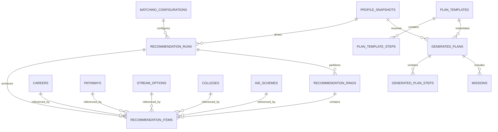

# Module 2 Data Model: Recommendation and Planning

Companion walkthrough: [Module 2 recommendation storage flow](module-2-recommendation-storage-flow.md).

## 1. Outcome and ownership

Module 2 owns the `recommendation` PostgreSQL schema. It converts an immutable Module 1 `ProfileSnapshot`, published Module 3 catalog records and versioned matching configuration into reproducible career, stream, pathway, college, aid and plan outputs.

It owns ranking, fit scores, explanations, ring membership, feasibility rules and deterministic plans. It does not own assessment scoring, knowledge ingestion, chat wording, user exploration events or AI-generated verdicts.

## 2. Inputs and outputs

### Inputs

| Input                         | Producer                 | Required fields                                                                 |
| ----------------------------- | ------------------------ | ------------------------------------------------------------------------------- |
| `ProfileSnapshot`             | Module 1                 | Snapshot ID/version/hash, segment, RIASEC, optional values, intake context      |
| Career/pathway/stream records | Module 3                 | Stable IDs, published status, interest/value profiles, routes, dataset versions |
| College/program records       | Module 3                 | Stable IDs, disciplines, state, type, tier, verification                        |
| Aid records/criteria          | Module 3                 | Stable IDs, structured criteria, source/freshness                               |
| Matching configuration        | Module 2 approved config | Weights, rounding, tie order, feasibility lookup, version                       |

### Primary output

```ts
type RecommendationSet = {
  recommendationId: string;
  profileSnapshotId: string;
  kind: "career" | "stream" | "pathway" | "college" | "aid" | "plan";
  items: Array<{
    itemId: string;
    entityType: string;
    entityId: string;
    rank: number;
    fitScore?: number;
    ring?: "inner" | "middle" | "outer";
    explanation: Record<string, unknown>;
  }>;
  algorithmVersion: string;
  weightsVersion: string;
  sourceDataVersions: Record<string, string>;
  inputHash: string;
  outputHash: string;
  createdAt: string;
};
```

The output contains completed rank/ring decisions. Module 4 renders it without recalculating.

## 3. Relationship overview



External entity names represent cross-schema references:

```text
PROFILE_SNAPSHOTS → assessment.profile_snapshots
CAREERS/PATHWAYS/STREAM_OPTIONS/COLLEGES/AID_SCHEMES → knowledge schema
```

## 4. Configuration tables

### `recommendation.matching_configurations`

Immutable after activation.

| Column               | Type           | Rules                                           |
| -------------------- | -------------- | ----------------------------------------------- |
| `id`                 | `uuid`         | PK                                              |
| `configuration_key`  | `text`         | e.g. `career_match`, `college_rank`, `aid_rank` |
| `version`            | `text`         | Unique with key                                 |
| `status`             | `text`         | `draft`, `active`, `retired`                    |
| `algorithm_version`  | `text`         | Required                                        |
| `interest_weight`    | `numeric(6,5)` | Nullable by kind                                |
| `values_weight`      | `numeric(6,5)` | Nullable by kind                                |
| `feasibility_weight` | `numeric(6,5)` | Nullable by kind                                |
| `context_weight`     | `numeric(6,5)` | Nullable by kind                                |
| `rounding_scale`     | `smallint`     | Required                                        |
| `riasec_tie_order`   | `char(1)[]`    | Must equal approved six-letter permutation      |
| `rules_json`         | `jsonb`        | Versioned bounded kind-specific rules           |
| `approved_by`        | `uuid`         | Staff Auth ID                                   |
| `approved_at`        | `timestamptz`  | Nullable until active                           |
| `created_at`         | `timestamptz`  | Required                                        |

For career matching, applicable weights must sum to `1.0`. When WIP is absent, the deterministic redistribution rule is part of `algorithm_version`, not an ad hoc runtime choice.

### `recommendation.feasibility_rules`

| Column               | Type           | Rules                                                             |
| -------------------- | -------------- | ----------------------------------------------------------------- |
| `id`                 | `uuid`         | PK                                                                |
| `configuration_id`   | `uuid`         | FK                                                                |
| `segment`            | `text`         | Required                                                          |
| `marks_band`         | `text`         | Approved band or `unknown`                                        |
| `education_route_id` | `uuid`         | FK to knowledge route                                             |
| `reachability`       | `numeric(4,2)` | Check values approved by config, initially `0.30`, `0.65`, `1.00` |
| `reason_key`         | `text`         | Approved explanation key                                          |
| `priority`           | `smallint`     | Resolve overlapping rules deterministically                       |

Unique effective rule combination is enforced and overlap tests are mandatory.

### `recommendation.counselor_priorities`

Optional reviewed context boost—not a hidden manual rank override.

| Column             | Type           | Rules                             |
| ------------------ | -------------- | --------------------------------- |
| `id`               | `uuid`         | PK                                |
| `configuration_id` | `uuid`         | FK                                |
| `career_id`        | `uuid`         | FK to knowledge career            |
| `state`            | `text`         | Nullable full state/UT name scope |
| `segment`          | `text`         | Nullable scope                    |
| `boost`            | `numeric(6,5)` | Bounded by configuration          |
| `reason_key`       | `text`         | Required                          |
| `effective_from`   | `timestamptz`  | Required                          |
| `expires_at`       | `timestamptz`  | Nullable                          |
| `approved_by`      | `uuid`         | Staff Auth ID                     |

## 5. Recommendation run tables

### `recommendation.recommendation_runs`

One immutable completed set per request; failure records contain no partial user-facing output.

| Column                      | Type          | Rules                                           |
| --------------------------- | ------------- | ----------------------------------------------- |
| `id`                        | `uuid`        | PK                                              |
| `user_id`                   | `uuid`        | FK to `auth.users`; authorized lookup           |
| `profile_snapshot_id`       | `uuid`        | FK to `assessment.profile_snapshots`            |
| `kind`                      | `text`        | `career`, `stream`, `pathway`, `college`, `aid` |
| `configuration_id`          | `uuid`        | FK                                              |
| `algorithm_version`         | `text`        | Required                                        |
| `weights_version`           | `text`        | Required where applicable                       |
| `source_data_versions_json` | `jsonb`       | Required map of dataset versions                |
| `request_context_json`      | `jsonb`       | Bounded filters/state selection, no raw chat    |
| `status`                    | `text`        | `running`, `completed`, `failed`                |
| `input_hash`                | `text`        | Required before calculation                     |
| `output_hash`               | `text`        | Required when completed                         |
| `error_code`                | `text`        | Nullable safe internal code                     |
| `created_at`                | `timestamptz` | Required                                        |
| `completed_at`              | `timestamptz` | Nullable                                        |

Indexes: `(user_id, created_at desc)`, `(profile_snapshot_id, kind)`, unique deterministic replay key if idempotent request semantics require it.

### `recommendation.recommendation_rings`

| Column                  | Type       | Rules                            |
| ----------------------- | ---------- | -------------------------------- |
| `id`                    | `uuid`     | PK                               |
| `recommendation_run_id` | `uuid`     | FK                               |
| `ring_code`             | `text`     | `inner`, `middle`, `outer`       |
| `display_order`         | `smallint` | 1, 2, 3                          |
| `rule_version`          | `text`     | Required                         |
| `reason_template_key`   | `text`     | Approved generic explanation key |

Unique `(recommendation_run_id, ring_code)`.

### `recommendation.recommendation_items`

Each row references exactly one Module 3 entity.

| Column                   | Type           | Rules                                             |
| ------------------------ | -------------- | ------------------------------------------------- |
| `id`                     | `uuid`         | PK                                                |
| `recommendation_run_id`  | `uuid`         | FK                                                |
| `ring_id`                | `uuid`         | Nullable FK                                       |
| `career_id`              | `uuid`         | Nullable FK to knowledge career                   |
| `pathway_id`             | `uuid`         | Nullable FK to knowledge pathway                  |
| `stream_option_id`       | `uuid`         | Nullable FK to stream option                      |
| `college_id`             | `uuid`         | Nullable FK to college                            |
| `aid_scheme_id`          | `uuid`         | Nullable FK to aid scheme                         |
| `rank`                   | `smallint`     | Positive, unique within run                       |
| `fit_score`              | `numeric(8,6)` | Nullable; check `0..1`                            |
| `interest_fit`           | `numeric(8,6)` | Nullable; check `0..1`                            |
| `values_fit`             | `numeric(8,6)` | Nullable; check `0..1`                            |
| `feasibility_score`      | `numeric(8,6)` | Nullable; check `0..1`                            |
| `context_boost`          | `numeric(8,6)` | Nullable/config bounded                           |
| `likelihood_label`       | `text`         | Aid only: `likely`, `check_conditions`, `explore` |
| `fit_explanation_json`   | `jsonb`        | Typed calculation evidence                        |
| `ring_reason_key`        | `text`         | Nullable approved reason                          |
| `entity_snapshot_json`   | `jsonb`        | Minimal approved display snapshot, versioned      |
| `entity_dataset_version` | `text`         | Required                                          |
| `created_at`             | `timestamptz`  | Required                                          |

Constraints:

- Exactly one entity FK is non-null.
- Entity type must agree with run kind.
- Rank is unique per run.
- Ring belongs to the same run.
- Completed run items are immutable.

Explicit nullable FKs are chosen instead of an unenforceable generic `entity_id` polymorphic reference.

## 6. Plan and mission tables

### `recommendation.plan_templates`

| Column                 | Type          | Rules                                                     |
| ---------------------- | ------------- | --------------------------------------------------------- |
| `id`                   | `uuid`        | PK                                                        |
| `template_key`         | `text`        | Unique with version                                       |
| `segment`              | `text`        | Required                                                  |
| `plan_type`            | `text`        | `exploration`, `pathway`, `career_90_day`, `backup_route` |
| `version`              | `text`        | Required                                                  |
| `status`               | `text`        | `draft`, `approved`, `retired`                            |
| `selection_rules_json` | `jsonb`       | Typed deterministic rules                                 |
| `approved_by`          | `uuid`        | Staff Auth ID                                             |
| `approved_at`          | `timestamptz` | Nullable                                                  |

### `recommendation.plan_template_steps`

| Column                     | Type       | Rules                                    |
| -------------------------- | ---------- | ---------------------------------------- |
| `id`                       | `uuid`     | PK                                       |
| `plan_template_id`         | `uuid`     | FK                                       |
| `step_order`               | `smallint` | Positive, unique per template            |
| `time_window`              | `text`     | e.g. days 1-30, 31-60, 61-90             |
| `action_key`               | `text`     | Approved action template                 |
| `completion_evidence_type` | `text`     | Optional non-sensitive evidence category |
| `is_optional`              | `boolean`  | Required                                 |

### `recommendation.generated_plans`

Immutable plan definition. Completion state belongs to Module 4 journey/mission events.

| Column                  | Type          | Rules                        |
| ----------------------- | ------------- | ---------------------------- |
| `id`                    | `uuid`        | PK                           |
| `user_id`               | `uuid`        | FK to Auth user              |
| `profile_snapshot_id`   | `uuid`        | FK                           |
| `recommendation_run_id` | `uuid`        | Nullable FK                  |
| `plan_template_id`      | `uuid`        | FK                           |
| `plan_version`          | `integer`     | Increasing per user/type     |
| `target_entity_type`    | `text`        | career/pathway/stream        |
| `target_entity_id`      | `uuid`        | Application-validated target |
| `input_hash`            | `text`        | Required                     |
| `output_hash`           | `text`        | Required                     |
| `created_at`            | `timestamptz` | Required                     |

### `recommendation.generated_plan_steps`

| Column                    | Type       | Rules                                |
| ------------------------- | ---------- | ------------------------------------ |
| `id`                      | `uuid`     | PK                                   |
| `generated_plan_id`       | `uuid`     | FK                                   |
| `source_template_step_id` | `uuid`     | FK                                   |
| `step_order`              | `smallint` | Unique within plan                   |
| `time_window`             | `text`     | Required                             |
| `action_text`             | `text`     | Deterministic approved template fill |
| `action_metadata_json`    | `jsonb`    | Bounded IDs/links only               |

### `recommendation.missions`

Explorer-safe missions generated from approved templates.

| Column              | Type          | Rules                                         |
| ------------------- | ------------- | --------------------------------------------- |
| `id`                | `uuid`        | PK                                            |
| `generated_plan_id` | `uuid`        | FK                                            |
| `mission_order`     | `smallint`    | Required                                      |
| `mission_text`      | `text`        | Approved deterministic template output        |
| `mission_type`      | `text`        | research, conversation, observation, practice |
| `created_at`        | `timestamptz` | Required                                      |

Student completion status is recorded as a Module 4 journey event so the immutable recommendation/plan does not mutate.

## 7. Deterministic calculation record

For every career item, `fit_explanation_json` stores the values necessary to explain and replay the result:

```json
{
  "schemaVersion": 1,
  "interestFit": 0.84,
  "valuesFit": 0.72,
  "feasibility": 1.0,
  "contextBoost": 0.05,
  "weights": {
    "interest": 0.5,
    "values": 0.2,
    "feasibility": 0.15,
    "context": 0.15
  },
  "topMatchingScales": ["I", "R"],
  "tradeoffKey": null
}
```

The record contains calculation evidence, not AI prose.

## 8. Input-to-storage-to-output matrix

| Use case           | Inputs                                    | Writes                  | Output                         |
| ------------------ | ----------------------------------------- | ----------------------- | ------------------------------ |
| Match careers      | profile snapshot, career profiles, config | run/rings/items         | Career `RecommendationSet`     |
| Recommend streams  | top RIASEC/profile, stream maps           | run/items               | Ordered stream set             |
| Recommend pathways | profile, pathway records                  | run/items               | Pathway set with backup routes |
| Rank colleges      | pathway/state, verified colleges          | run/rings/items         | College rings                  |
| Group aid          | volunteered facts, criteria               | run/rings/items         | Aid rings/unknown evidence     |
| Generate plan      | profile, selected entity, template        | plan/steps/missions     | Immutable plan DTO             |
| Replay             | stored snapshot/config/dataset versions   | no user-facing mutation | Hash comparison/report         |

## 9. State and immutability

```text
running → completed
       └→ failed
```

- A completed recommendation is immutable.
- Recalculation creates a new run.
- Failed runs do not expose partial rankings.
- Activating new weights/configuration never changes historical outputs.
- Retired catalog entities remain resolvable for historical outputs.

## 10. Access and privacy

- Students access recommendation sets linked to their own profile snapshots.
- Module 4 receives completed DTOs, not matching configuration internals unless explanation fields are approved.
- Module 2 never reads raw assessment responses or conversations.
- Aid matching uses only stored/volunteered facts; unknown values remain unknown.
- Salary is excluded from fit calculation.
- Staff priority boosts are versioned, bounded and auditable.
- No LLM-provided score, rank, ring or eligibility label is accepted by write APIs.

## 11. Retention and deletion

- Recommendation runs/plans delete with the user privacy job unless policy requires a de-identified audit proof.
- Configuration and non-PII test vectors remain for reproducibility.
- Historical catalog/version references remain available even if the user record is deleted.
- Hashes retained after deletion must not be usable to reconstruct personal data.

## 12. Migration slices

```text
m2_001_matching_configuration
m2_002_recommendation_runs
m2_003_rings_items_constraints
m2_004_plan_templates
m2_005_generated_plans_missions
m2_006_indexes_privileges
```

## 13. Required tests

- TV-6 exact ranking and explanation fields.
- TV-7 exact ring partition.
- Input order does not change output order/hash.
- Missing WIP redistributes weight exactly.
- Exact ties sort by approved deterministic rule/title where specified.
- A recommendation item cannot reference two entity types or none.
- Unknown aid fact never moves a scheme inward.
- Career outer ring includes required vocational and unexpected items when candidates exist.
- College ranking respects discipline, tier, proximity and name order.
- Replaying stored versions produces the same output hash.
- API rejects LLM-provided fit score/ring assignment.

## 14. Open decisions

| Decision                                      | Status                         |
| --------------------------------------------- | ------------------------------ |
| Final numeric rounding mode/precision         | Open P0 before golden fixtures |
| Exact normalization of career source vectors  | Open P0 with data owner        |
| Fallback when ring invariants lack candidates | Product/data decision          |
| Approved feasibility lookup values/reasons    | Counselor review               |
| Context-boost maximum and ownership           | Product/fairness review        |
| Aid criterion vocabulary                      | Module 3/2 review              |

## 15. Module-ready criteria

- Public inputs depend only on Module 1/3 contracts.
- All configuration and dataset versions are recorded.
- Completed outputs are immutable and replayable.
- Every recommendation item has one enforceable catalog reference.
- Module 4 can render without recalculating rank/ring/fit.
- TV-6/TV-7 and property tests pass with no AI dependency.
