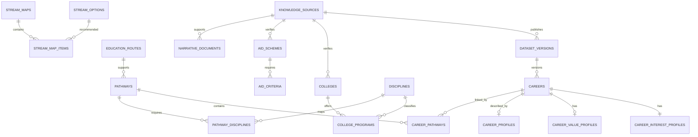

# Module 3 Data Model: Knowledge and Grounding

Companion walkthrough: [Module 3 knowledge storage flow](module-3-knowledge-storage-flow.md).

## 1. Outcome and ownership

Module 3 owns the `knowledge` PostgreSQL schema, reviewed source data and ingestion metadata. It provides stable, versioned records for careers, interest/value profiles, pathways, streams, colleges, programs, aid schemes and approved narrative content.

Module 3 does not calculate user fit, rank/ring entities, write chat responses, decide aid eligibility, or perform unrestricted web search at response time.

RAG embeddings are excluded from Phase A. Structured records are the source of truth.

## 2. Inputs and outputs

### Inputs

| Input             | Source                                  | Required validation                                        |
| ----------------- | --------------------------------------- | ---------------------------------------------------------- |
| Career catalog    | O*NET/manual reviewed datasets          | Identifier, title, source, version, required RIASEC fields |
| Pathways/routes   | Reviewed project datasets               | Referenced career/route existence                          |
| Stream mapping    | Approved mapping table                  | Valid top-two RIASEC code and option IDs                   |
| Colleges/programs | Approved government/institution sources | State, source, verification date                           |
| Aid schemes       | Official provider/portal sources        | URL, scope, criteria, window, verification                 |
| Career profiles   | Counselor/editor review                 | Reviewed fields and source provenance                      |
| Narrative content | Approved editor pipeline                | Review status, source and language                         |

### Outputs

```ts
type CatalogEntity = {
  id: string;
  entityType: "career" | "pathway" | "stream" | "college" | "program" | "aid";
  title: string;
  status: "published" | "retired";
  datasetVersion: string;
  sourceRefs: string[];
  lastVerifiedAt?: string;
};

type RetrievedEvidence = {
  queryType: string;
  entities: CatalogEntity[];
  sourceVersions: Record<string, string>;
  retrievedAt: string;
};
```

Module 2 consumes typed catalog records. Module 4 receives bounded tool outputs containing only published fields.

## 3. Relationship overview



## 4. Provenance and publication tables

### `knowledge.knowledge_sources`

| Column        | Type          | Rules                                                                   |
| ------------- | ------------- | ----------------------------------------------------------------------- |
| `id`          | `uuid`        | PK                                                                      |
| `source_key`  | `text`        | Unique stable key                                                       |
| `name`        | `text`        | Required                                                                |
| `source_type` | `text`        | `government`, `official_portal`, `institution`, `onet`, `manual_review` |
| `base_url`    | `text`        | Nullable; validated URL                                                 |
| `publisher`   | `text`        | Required                                                                |
| `license_ref` | `text`        | Nullable in mock data; required before publication when applicable      |
| `trust_level` | `text`        | `authoritative`, `reviewed_secondary`, `internal_reviewed`              |
| `status`      | `text`        | `active`, `inactive`                                                    |
| `created_at`  | `timestamptz` | Required                                                                |
| `updated_at`  | `timestamptz` | Required                                                                |

### `knowledge.dataset_versions`

Immutable record for an ingestion/import batch.

| Column                   | Type          | Rules                                                        |
| ------------------------ | ------------- | ------------------------------------------------------------ |
| `id`                     | `uuid`        | PK                                                           |
| `source_id`              | `uuid`        | FK                                                           |
| `dataset_key`            | `text`        | e.g. `careers`, `colleges_south_india`                       |
| `version`                | `text`        | Unique with dataset key                                      |
| `checksum`               | `text`        | Required                                                     |
| `record_count`           | `integer`     | Non-negative                                                 |
| `import_status`          | `text`        | `staged`, `validated`, `published`, `rejected`, `superseded` |
| `validation_report_json` | `jsonb`       | Bounded/versioned                                            |
| `imported_at`            | `timestamptz` | Required                                                     |
| `published_at`           | `timestamptz` | Nullable                                                     |
| `created_by`             | `uuid`        | Staff Auth ID or service actor                               |

Published versions are immutable. Re-import creates a new version.

### `knowledge.entity_source_links`

Supports multiple sources per record without embedding provenance into prose.

| Column               | Type          | Rules                           |
| -------------------- | ------------- | ------------------------------- |
| `id`                 | `uuid`        | PK                              |
| `entity_type`        | `text`        | Approved catalog type           |
| `entity_id`          | `uuid`        | Application-validated target ID |
| `source_id`          | `uuid`        | FK                              |
| `dataset_version_id` | `uuid`        | FK                              |
| `source_url`         | `text`        | Nullable validated URL          |
| `source_record_key`  | `text`        | Nullable external identifier    |
| `supports_fields`    | `text[]`      | Fields supported by source      |
| `last_verified_at`   | `timestamptz` | Nullable                        |

Because the target is polymorphic, application/ingestion validation plus integrity tests enforce entity existence.

## 5. Career and pathway tables

### `knowledge.careers`

| Column                       | Type          | Rules                                     |
| ---------------------------- | ------------- | ----------------------------------------- |
| `id`                         | `uuid`        | PK                                        |
| `onet_code`                  | `text`        | Nullable unique external key              |
| `nco_code`                   | `text`        | Nullable future external key              |
| `slug`                       | `text`        | Unique public slug                        |
| `title`                      | `text`        | Required                                  |
| `short_description`          | `text`        | Approved bounded prose                    |
| `domain_code`                | `text`        | Indexed constrained code                  |
| `primary_education_route_id` | `uuid`        | FK to education route                     |
| `is_curated`                 | `boolean`     | Required                                  |
| `publication_status`         | `text`        | `draft`, `review`, `published`, `retired` |
| `dataset_version_id`         | `uuid`        | FK; required                              |
| `published_at`               | `timestamptz` | Nullable                                  |
| `retired_at`                 | `timestamptz` | Nullable                                  |
| `created_at`                 | `timestamptz` | Required                                  |
| `updated_at`                 | `timestamptz` | Required until publication/retirement     |

Indexes: published `(title)`, `(domain_code)`, `(onet_code)`, optional PostgreSQL full-text index for title/approved description.

### `knowledge.career_interest_profiles`

RIASEC profile used for deterministic matching; not a RAG embedding.

| Column               | Type           | Rules             |
| -------------------- | -------------- | ----------------- |
| `career_id`          | `uuid`         | PK/FK             |
| `realistic`          | `numeric(6,5)` | Check `0..1`      |
| `investigative`      | `numeric(6,5)` | Check `0..1`      |
| `artistic`           | `numeric(6,5)` | Check `0..1`      |
| `social`             | `numeric(6,5)` | Check `0..1`      |
| `enterprising`       | `numeric(6,5)` | Check `0..1`      |
| `conventional`       | `numeric(6,5)` | Check `0..1`      |
| `high_point_code`    | `char(1)`      | Check R/I/A/S/E/C |
| `profile_version`    | `text`         | Required          |
| `dataset_version_id` | `uuid`         | FK                |

### `knowledge.career_value_profiles`

| Column               | Type           | Rules        |
| -------------------- | -------------- | ------------ |
| `career_id`          | `uuid`         | PK/FK        |
| `achievement`        | `numeric(6,5)` | Check `0..1` |
| `independence`       | `numeric(6,5)` | Check `0..1` |
| `recognition`        | `numeric(6,5)` | Check `0..1` |
| `relationships`      | `numeric(6,5)` | Check `0..1` |
| `support`            | `numeric(6,5)` | Check `0..1` |
| `working_conditions` | `numeric(6,5)` | Check `0..1` |
| `profile_version`    | `text`         | Required     |
| `dataset_version_id` | `uuid`         | FK           |

### `knowledge.career_profiles`

Rich detail available only when reviewed.

| Column              | Type          | Rules                              |
| ------------------- | ------------- | ---------------------------------- |
| `career_id`         | `uuid`        | PK/FK                              |
| `image_ref`         | `text`        | Nullable approved asset            |
| `salary_entry_band` | `text`        | Nullable; reviewed structured band |
| `salary_note`       | `text`        | Nullable approved caveat           |
| `skills`            | `text[]`      | Bounded approved list              |
| `next_role_3yr`     | `text`        | Nullable                           |
| `progression_note`  | `text`        | Nullable                           |
| `review_status`     | `text`        | `draft`, `reviewed`, `retired`     |
| `last_reviewed_at`  | `timestamptz` | Nullable                           |
| `reviewed_by`       | `uuid`        | Nullable staff Auth ID             |

Unreviewed salary/progression fields are not returned to users.

### `knowledge.education_routes`

| Column               | Type   | Rules                                                                              |
| -------------------- | ------ | ---------------------------------------------------------------------------------- |
| `id`                 | `uuid` | PK                                                                                 |
| `route_code`         | `text` | Unique                                                                             |
| `title`              | `text` | Required                                                                           |
| `route_level`        | `text` | `school_stream`, `certificate`, `iti`, `diploma`, `degree`, `postgraduate`, `open` |
| `description`        | `text` | Approved                                                                           |
| `publication_status` | `text` | Required                                                                           |

### `knowledge.pathways`

| Column               | Type   | Rules                   |
| -------------------- | ------ | ----------------------- |
| `id`                 | `uuid` | PK                      |
| `pathway_code`       | `text` | Unique                  |
| `title`              | `text` | Required                |
| `description`        | `text` | Approved                |
| `education_route_id` | `uuid` | FK                      |
| `duration_band`      | `text` | Nullable                |
| `backup_route_note`  | `text` | Nullable approved prose |
| `publication_status` | `text` | Required                |
| `dataset_version_id` | `uuid` | FK                      |

### `knowledge.career_pathways`

| Column              | Type       | Rules                                  |
| ------------------- | ---------- | -------------------------------------- |
| `career_id`         | `uuid`     | FK                                     |
| `pathway_id`        | `uuid`     | FK                                     |
| `relationship_type` | `text`     | `primary`, `alternative`, `vocational` |
| `display_order`     | `smallint` | Positive                               |

PK: `(career_id, pathway_id)`.

### `knowledge.stream_options`, `knowledge.stream_maps`, `knowledge.stream_map_items`

`stream_options` defines stable stream choices. `stream_maps` is keyed by an approved top-two RIASEC code and version. `stream_map_items` links a map to ordered options with approved reasons/missions.

Required fields:

```text
stream_options: id, stream_code, title, description, status
stream_maps: id, top_two_code, version, dataset_version_id, status
stream_map_items: map_id, stream_option_id, rank, reason_key
```

Mission templates belong to Module 2. Module 3 publishes stream facts/mappings without referencing recommendation tables.

## 6. College tables

### `knowledge.colleges`

| Column                | Type          | Rules                                                |
| --------------------- | ------------- | ---------------------------------------------------- |
| `id`                  | `uuid`        | PK                                                   |
| `external_code`       | `text`        | Nullable source-specific key                         |
| `name`                | `text`        | Required                                             |
| `city`                | `text`        | Required                                             |
| `state`               | `text`        | Indexed official full state/UT name                  |
| `institution_type`    | `text`        | e.g. university, college, polytechnic, ITI, open     |
| `tier`                | `smallint`    | Nullable approved project tier; never inferred by AI |
| `admission_route`     | `text`        | Nullable approved summary                            |
| `fees_band`           | `text`        | Nullable reviewed band                               |
| `website_url`         | `text`        | Nullable official URL                                |
| `verification_status` | `text`        | `unverified`, `verified`, `stale`, `retired`         |
| `last_verified_at`    | `timestamptz` | Nullable                                             |
| `dataset_version_id`  | `uuid`        | FK                                                   |
| `created_at`          | `timestamptz` | Required                                             |
| `updated_at`          | `timestamptz` | Required                                             |

Unique source identity is `(dataset_version_id, external_code)` where present. Search indexes cover normalized name, state and type.

### `knowledge.disciplines`

Stable controlled vocabulary: `id`, unique `discipline_code`, title, domain code and status.

### `knowledge.college_programs`

| Column                | Type          | Rules    |
| --------------------- | ------------- | -------- |
| `id`                  | `uuid`        | PK       |
| `college_id`          | `uuid`        | FK       |
| `discipline_id`       | `uuid`        | FK       |
| `program_name`        | `text`        | Required |
| `qualification_level` | `text`        | Required |
| `duration_band`       | `text`        | Nullable |
| `admission_route`     | `text`        | Nullable |
| `fees_band`           | `text`        | Nullable |
| `verification_status` | `text`        | Required |
| `last_verified_at`    | `timestamptz` | Nullable |
| `dataset_version_id`  | `uuid`        | FK       |

Unique: normalized `(college_id, program_name, qualification_level)` within dataset version.

### `knowledge.pathway_disciplines`

Many-to-many mapping used by Module 2 college ranking: `pathway_id`, `discipline_id`, `relevance_weight`, `mapping_version`.

## 7. Aid tables

### `knowledge.aid_schemes`

| Column                | Type          | Rules                                               |
| --------------------- | ------------- | --------------------------------------------------- |
| `id`                  | `uuid`        | PK                                                  |
| `aid_code`            | `text`        | Unique stable code                                  |
| `name`                | `text`        | Required                                            |
| `provider_type`       | `text`        | central, state, CSR, institution, meta              |
| `provider`            | `text`        | Required                                            |
| `level`               | `text`        | Approved education level                            |
| `states`              | `text[]`      | Empty means nationwide only when explicitly defined |
| `eligibility_summary` | `text`        | Approved non-verdict prose                          |
| `benefit_summary`     | `text`        | Approved                                            |
| `amount_text`         | `text`        | Nullable; preserve source wording                   |
| `application_url`     | `text`        | Official validated URL                              |
| `portal_name`         | `text`        | Nullable                                            |
| `apply_window_start`  | `date`        | Nullable                                            |
| `apply_window_end`    | `date`        | Nullable                                            |
| `verification_status` | `text`        | `verified`, `stale`, `retired`                      |
| `last_verified_at`    | `timestamptz` | Required for user publication                       |
| `dataset_version_id`  | `uuid`        | FK                                                  |

### `knowledge.aid_criteria`

Structured criteria support likelihood grouping without claiming legal eligibility.

| Column              | Type      | Rules                                                                                |
| ------------------- | --------- | ------------------------------------------------------------------------------------ |
| `id`                | `uuid`    | PK                                                                                   |
| `aid_scheme_id`     | `uuid`    | FK                                                                                   |
| `criterion_type`    | `text`    | state, level, marks_band, income_band, category, disability, gender or approved type |
| `operator`          | `text`    | `equals`, `in`, `min`, `max`, `unknown_check`                                        |
| `value_json`        | `jsonb`   | Typed by criterion type                                                              |
| `is_required`       | `boolean` | Required                                                                             |
| `source_text`       | `text`    | Exact/approved supporting summary                                                    |
| `criterion_version` | `text`    | Required                                                                             |

Unknown user facts never count as satisfied.

## 8. Narrative content without RAG

### `knowledge.narrative_documents`

| Column             | Type          | Rules                                           |
| ------------------ | ------------- | ----------------------------------------------- |
| `id`               | `uuid`        | PK                                              |
| `document_key`     | `text`        | Unique with version/language                    |
| `document_type`    | `text`        | FAQ, guidance, career narrative, admission note |
| `title`            | `text`        | Required                                        |
| `content`          | `text`        | Approved bounded content                        |
| `language`         | `text`        | Required                                        |
| `version`          | `text`        | Required                                        |
| `review_status`    | `text`        | `draft`, `approved`, `retired`                  |
| `source_id`        | `uuid`        | FK                                              |
| `last_reviewed_at` | `timestamptz` | Nullable                                        |
| `content_hash`     | `text`        | Required                                        |

Phase A retrieval uses IDs, filters and optional PostgreSQL full-text search. A future `narrative_chunks`/embedding model requires a new reviewed migration and embedding-model version.

## 9. Input-to-storage-to-output matrix

| Use case       | Input                     | Writes/reads                              | Output                                        |
| -------------- | ------------------------- | ----------------------------------------- | --------------------------------------------- |
| Import dataset | source/version/file rows  | source, version, staging/published tables | Validation report/version ID                  |
| Get career     | career ID/code            | career/profile/pathway/source tables      | `CareerRecord`                                |
| List streams   | top-two RIASEC code       | stream map tables                         | Ordered stream options                        |
| Get colleges   | pathway/state filters     | colleges/programs/disciplines             | Verified candidate records                    |
| Get aid        | profile facts/level/state | aid/criteria                              | Candidate schemes with known/unknown evidence |
| Search         | bounded query/type        | published catalog/full text               | Paged IDs/titles                              |

## 10. Publication and freshness rules

```text
staged → validated → published → superseded
                    └─────────→ rejected
```

- Only published/verified records reach user tools.
- A stale record remains visible only under an approved policy and must carry a freshness warning.
- Retiring an entity does not delete historical records referenced by recommendations/reports.
- Ingestion never auto-publishes AI-generated descriptions.

## 11. Access and security

- Write access is limited to ingestion/review services and authorized staff tools.
- Users receive read-only bounded DTOs through Express.
- Module 2 receives published matching fields through a repository port.
- Correct source URLs/amounts are copied from approved fields; Claude cannot write them.
- Draft, validation report and unpublished salary fields are backend/staff only.
- `data/raw` remains immutable and outside general application access.

## 12. Retention

- Published dataset versions remain available for recommendation replay.
- Retired entities remain minimally available for historical report integrity.
- Rejected staging data may be removed after its validation/audit window.
- Source/license metadata is retained with every published version.
- No user personal data belongs in the knowledge schema.

## 13. Migration slices

```text
m3_001_sources_dataset_versions
m3_002_careers_profiles
m3_003_routes_pathways_streams
m3_004_colleges_programs_disciplines
m3_005_aid_criteria
m3_006_narrative_content
m3_007_indexes_publication_privileges
```

## 14. Required tests

- Duplicate dataset version/checksum is handled idempotently.
- Invalid RIASEC/value range is rejected.
- Published career has required source/version fields.
- Unreviewed salary or career profile is not user-visible.
- College search returns only approved records and deterministic order.
- Aid retrieval preserves unknown criteria rather than treating them as matched.
- Every returned entity resolves to source and dataset version.
- Retired records remain resolvable for historical recommendation replay.
- No embedding extension/table is required by Phase A tests.

## 15. Open decisions

| Decision                                                   | Status              |
| ---------------------------------------------------------- | ------------------- |
| Final career/college/aid source files and licenses         | Open P0             |
| Controlled domain/discipline/route vocabularies            | Proposed            |
| Freshness thresholds per entity type                       | Product/data review |
| Exact verified career-profile fields available for POC     | Data review         |
| Whether PostgreSQL full-text search is included in Phase A | Optional            |
| RAG chunking/embedding model                               | Deferred            |

## 16. Module-ready criteria

- Every published record has source and dataset version.
- Import/validation is reproducible from versioned non-PII fixtures.
- Stable IDs survive re-imports.
- Module 2 can match through public ports without querying private ingestion tables.
- Module 4 tools cannot retrieve draft/unverified facts.
- Exact source/freshness metadata accompanies user-visible facts.
