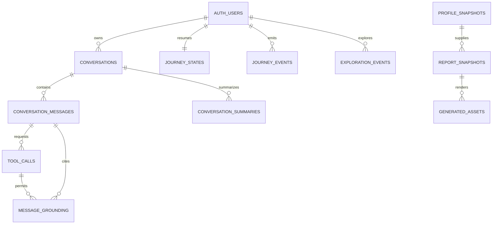

# Module 4 Data Model: AI Counselor and Experience

Companion walkthrough: [Module 4 counselor storage flow](module-4-counselor-storage-flow.md).

## 1. Outcome and ownership

Module 4 owns the `counselor` PostgreSQL schema. It stores bounded conversation state, tool-call audit metadata, journey state, exploration events, immutable report snapshots and generated asset metadata.

It does not own assessment scores, recommendation calculations, catalog facts or safety tiers. Those arrive through typed Module 1–3/5 ports.

The core journey must work with the AI provider disabled.

## 2. Inputs and outputs

### Inputs

| Input                             | Producer                            |
| --------------------------------- | ----------------------------------- |
| Authenticated user message/action | React client                        |
| `ProfileSnapshot`                 | Module 1                            |
| `RecommendationSet` and plan      | Module 2                            |
| Catalog/tool evidence             | Module 3                            |
| `SafetyDecision`/handoff result   | Module 5                            |
| Approved copy/widget definitions  | Versioned application configuration |

### Outputs

```ts
type AssistantTurn = {
  turnId: string;
  conversationId: string;
  text: string;
  widgets: WidgetDirective[];
  grounding: {
    toolCallIds: string[];
    entityIds: string[];
    recommendationIds: string[];
  };
  flags: string[];
  createdAt: string;
};

type ReportSnapshot = {
  reportId: string;
  profileSnapshotId: string;
  recommendationIds: string[];
  exploredEntityIds: string[];
  payloadHash: string;
  createdAt: string;
};
```

## 3. Relationship overview



`PROFILE_SNAPSHOTS` is `assessment.profile_snapshots`. Recommendation IDs in report payloads are validated against Module 2.

## 4. Conversation tables

### `counselor.conversations`

| Column                  | Type          | Rules                                                       |
| ----------------------- | ------------- | ----------------------------------------------------------- |
| `id`                    | `uuid`        | PK                                                          |
| `user_id`               | `uuid`        | FK to `auth.users`                                          |
| `start_idempotency_key` | `uuid`        | Required; retryable start key scoped to user                |
| `profile_snapshot_id`   | `uuid`        | Nullable FK to current snapshot used at start               |
| `segment`               | `text`        | Snapshot for behavior/copy                                  |
| `status`                | `text`        | `active`, `paused`, `completed`, `safety_locked`, `deleted` |
| `channel`               | `text`        | Phase A `web`                                               |
| `language`              | `text`        | Phase A `en`                                                |
| `ai_mode`               | `text`        | `enabled`, `degraded`, `disabled`                           |
| `started_at`            | `timestamptz` | Required                                                    |
| `last_turn_at`          | `timestamptz` | Nullable                                                    |
| `completed_at`          | `timestamptz` | Nullable                                                    |
| `created_at`            | `timestamptz` | Required                                                    |

Indexes: `(user_id, started_at desc)`, active conversation partial index.

### `counselor.conversation_messages`

| Column                     | Type          | Rules                                                      |
| -------------------------- | ------------- | ---------------------------------------------------------- |
| `id`                       | `uuid`        | PK                                                         |
| `conversation_id`          | `uuid`        | FK                                                         |
| `idempotency_key`          | `uuid`        | Required; retryable write key scoped to conversation       |
| `client_message_id`        | `uuid`        | Nullable legacy/internal client correlation ID             |
| `turn_number`              | `integer`     | Positive; no duplicates within a conversation              |
| `role`                     | `text`        | `user`, `assistant`, `system_copy`                         |
| `content`                  | `text`        | Bounded; may contain personal free text                    |
| `content_language`         | `text`        | Required                                                   |
| `message_status`           | `text`        | `received`, `generating`, `completed`, `blocked`, `failed` |
| `provider_message_id_hash` | `text`        | Nullable; never raw provider secret                        |
| `prompt_version`           | `text`        | Nullable for assistant turn                                |
| `model_name`               | `text`        | Nullable for AI-generated turn                             |
| `flags`                    | `text[]`      | Approved codes only                                        |
| `created_at`               | `timestamptz` | Required                                                   |

No database trigger sends message content to an AI provider. The application service performs safety pre-check first.

### `counselor.conversation_summaries`

Bounded context summary for older turns.

| Column            | Type          | Rules                                                |
| ----------------- | ------------- | ---------------------------------------------------- |
| `id`              | `uuid`        | PK                                                   |
| `conversation_id` | `uuid`        | FK                                                   |
| `from_turn`       | `integer`     | Required                                             |
| `to_turn`         | `integer`     | Required; greater/equal from                         |
| `summary_json`    | `jsonb`       | Typed facts/intents, not unrestricted hidden profile |
| `summary_version` | `text`        | Required                                             |
| `source_hash`     | `text`        | Required                                             |
| `created_at`      | `timestamptz` | Required                                             |

Unique `(conversation_id, from_turn, to_turn, summary_version)`.

## 5. Tool and grounding tables

### `counselor.tool_calls`

| Column                 | Type          | Rules                                                      |
| ---------------------- | ------------- | ---------------------------------------------------------- |
| `id`                   | `uuid`        | PK                                                         |
| `conversation_id`      | `uuid`        | FK                                                         |
| `request_message_id`   | `uuid`        | FK to assistant generating turn                            |
| `tool_name`            | `text`        | Approved registry only                                     |
| `tool_schema_version`  | `text`        | Required                                                   |
| `input_json`           | `jsonb`       | Zod-validated and size bounded                             |
| `input_hash`           | `text`        | Required                                                   |
| `output_snapshot_json` | `jsonb`       | Bounded approved result or reference snapshot              |
| `output_hash`          | `text`        | Nullable until success                                     |
| `source_versions_json` | `jsonb`       | Required when successful                                   |
| `status`               | `text`        | `requested`, `running`, `succeeded`, `failed`, `timed_out` |
| `latency_ms`           | `integer`     | Nullable, non-negative                                     |
| `error_code`           | `text`        | Nullable safe code                                         |
| `started_at`           | `timestamptz` | Required                                                   |
| `completed_at`         | `timestamptz` | Nullable                                                   |

Approved tool registry:

```text
get_profile
match_careers
get_career
get_streams
get_colleges
get_aid_schemes
request_handoff
```

Raw phones, unrestricted conversations and hidden scoring keys are excluded from tool snapshots.

### `counselor.message_grounding`

Records the same-turn allowlist used by the entity/number/URL linter.

| Column                 | Type     | Rules                                                        |
| ---------------------- | -------- | ------------------------------------------------------------ |
| `id`                   | `uuid`   | PK                                                           |
| `assistant_message_id` | `uuid`   | FK                                                           |
| `tool_call_id`         | `uuid`   | FK                                                           |
| `entity_type`          | `text`   | career, college, aid, pathway, degree, exam or approved type |
| `entity_id`            | `uuid`   | Owning-module ID; application validated                      |
| `display_name`         | `text`   | Exact allowed name                                           |
| `allowed_numbers_json` | `jsonb`  | Bounded approved values                                      |
| `allowed_urls`         | `text[]` | Exact approved URLs                                          |
| `source_version`       | `text`   | Required                                                     |

The linter result itself is stored as message flags and an audit event; failed text is not exposed to the user.

## 6. Journey and exploration tables

### `counselor.journey_states`

One mutable resumable state per user/journey.

| Column                      | Type          | Rules                                 |
| --------------------------- | ------------- | ------------------------------------- |
| `user_id`                   | `uuid`        | PK/FK to Auth user                    |
| `conversation_id`           | `uuid`        | Nullable FK                           |
| `current_step`              | `smallint`    | Check `1..5`                          |
| `current_state_key`         | `text`        | Approved state machine key            |
| `profile_snapshot_id`       | `uuid`        | Nullable FK                           |
| `current_recommendation_id` | `uuid`        | Nullable Module 2 ID; app validated   |
| `current_assessment_run_id` | `uuid`        | Nullable Module 1 ID; app validated   |
| `is_safety_paused`          | `boolean`     | Default false                         |
| `state_json`                | `jsonb`       | Minimal bounded navigation state      |
| `lock_version`              | `integer`     | Optimistic concurrency                |
| `last_idempotency_key`      | `uuid`        | Nullable latest retryable state write |
| `updated_at`                | `timestamptz` | Required                              |

The state cannot mark Step 5 complete before a report/share action emits the required event.

### `counselor.journey_events`

Append-only event history used to reconstruct breadcrumb state.

| Column                 | Type          | Rules                    |
| ---------------------- | ------------- | ------------------------ |
| `id`                   | `uuid`        | PK                       |
| `user_id`              | `uuid`        | FK                       |
| `producer_event_id`    | `uuid`        | Unique idempotency ID    |
| `conversation_id`      | `uuid`        | Nullable FK              |
| `event_type`           | `text`        | Approved event catalog   |
| `event_schema_version` | `integer`     | Required                 |
| `related_entity_type`  | `text`        | Nullable                 |
| `related_entity_id`    | `uuid`        | Nullable                 |
| `metadata_json`        | `jsonb`       | Non-PII bounded metadata |
| `occurred_at`          | `timestamptz` | Required                 |

Unique producer event ID/idempotency is required when events arrive from another module.

### `counselor.exploration_events`

Records what the user opened/selected for report assembly without modifying recommendations.

| Column                   | Type          | Rules                                                         |
| ------------------------ | ------------- | ------------------------------------------------------------- |
| `id`                     | `uuid`        | PK                                                            |
| `user_id`                | `uuid`        | FK                                                            |
| `conversation_id`        | `uuid`        | Nullable FK                                                   |
| `recommendation_id`      | `uuid`        | Module 2 run ID; app validated                                |
| `recommendation_item_id` | `uuid`        | Module 2 item ID; app validated                               |
| `action`                 | `text`        | `viewed`, `compared`, `selected`, `deselected`, `plan_opened` |
| `occurred_at`            | `timestamptz` | Required                                                      |
| `client_event_id`        | `uuid`        | Unique idempotency ID                                         |

General analytics receives only aggregated action counts, not the full user exploration history.

## 7. Reports and generated assets

### `counselor.report_snapshots`

Immutable report input. Rendering must not fetch new recommendations.

| Column                  | Type          | Rules                                         |
| ----------------------- | ------------- | --------------------------------------------- |
| `id`                    | `uuid`        | PK                                            |
| `user_id`               | `uuid`        | FK                                            |
| `idempotency_key`       | `uuid`        | Required; retryable report key scoped to user |
| `profile_snapshot_id`   | `uuid`        | FK to assessment snapshot                     |
| `recommendation_ids`    | `uuid[]`      | Validated Module 2 run IDs                    |
| `exploration_event_ids` | `uuid[]`      | Selected relevant events                      |
| `explored_entity_ids`   | `uuid[]`      | Frozen explored entity IDs for output         |
| `report_schema_version` | `integer`     | Required                                      |
| `language`              | `text`        | Required                                      |
| `payload_json`          | `jsonb`       | Complete versioned report DTO                 |
| `payload_hash`          | `text`        | Required                                      |
| `summary_mode`          | `text`        | `template`, `ai_polished`                     |
| `prompt_version`        | `text`        | Nullable                                      |
| `created_at`            | `timestamptz` | Required                                      |

Any AI polish must pass the same entity/number linter and may not change facts. Template mode is always available.

### `counselor.generated_assets`

| Column               | Type          | Rules                                                           |
| -------------------- | ------------- | --------------------------------------------------------------- |
| `id`                 | `uuid`        | PK                                                              |
| `user_id`            | `uuid`        | FK                                                              |
| `report_snapshot_id` | `uuid`        | Nullable FK                                                     |
| `asset_type`         | `text`        | `report_pdf`, `share_card`                                      |
| `storage_bucket`     | `text`        | Approved bucket                                                 |
| `storage_path`       | `text`        | Unique opaque path                                              |
| `content_hash`       | `text`        | Required                                                        |
| `privacy_class`      | `text`        | `private_report`, `share_safe`                                  |
| `generation_status`  | `text`        | `queued`, `generating`, `ready`, `failed`, `expired`, `deleted` |
| `expires_at`         | `timestamptz` | Required for private download/share link policy                 |
| `created_at`         | `timestamptz` | Required                                                        |
| `deleted_at`         | `timestamptz` | Nullable                                                        |

Share-card validation forbids phone, age, city, school, scores and selections; it includes only approved first-name/code branding fields.

## 8. Input-to-storage-to-output matrix

| Use case           | Inputs                                     | Writes                                                 | Output                         |
| ------------------ | ------------------------------------------ | ------------------------------------------------------ | ------------------------------ |
| Start conversation | user/profile; segment derived from profile | conversation, journey state                            | Welcome/static turn            |
| Send message       | message + bounded context                  | user message, tool calls, assistant message, grounding | `AssistantTurn` SSE            |
| AI unavailable     | message + static upstream data             | messages/events                                        | Template response/widgets      |
| Explore entity     | recommendation item/action                 | exploration event, journey event                       | Detail/list state              |
| Update journey     | valid event/current version                | journey event/state                                    | Persisted breadcrumb state     |
| Build report       | frozen profile/recommendations/exploration | report snapshot                                        | Report DTO                     |
| Render asset       | report snapshot                            | generated asset metadata                               | Signed private URL/share asset |

## 9. Runtime order and state

```text
receive user message
→ Module 5 safety pre-check
→ persist user message if allowed by policy
→ load bounded conversation/profile state
→ static route or AI tool loop
→ validate tool inputs and outputs
→ build same-turn grounding allowlist
→ lint assistant response
→ regenerate once on violation
→ deterministic fallback on second failure
→ persist final assistant turn/widgets
→ stream to client
```

Conversation status transition:

```text
active → paused → active
active → safety_locked
active/paused → completed
any permitted state → deleted through privacy job
```

## 10. Access and privacy

- A user accesses only their conversations, journey, reports and assets through Express.
- General staff cannot read conversation messages.
- Safety excerpts are copied only into Module 5 restricted records under policy; Module 4 does not grant staff broad chat access.
- Provider prompts/responses are not logged outside the bounded message/tool records.
- Conversation summaries cannot introduce facts not found in source turns/tool results.
- Report PDFs are private Supabase Storage objects delivered through expiring signed URLs.
- Share cards pass an explicit privacy allowlist.

## 11. Retention and deletion

| Data                    | Behavior                                                       |
| ----------------------- | -------------------------------------------------------------- |
| Conversations/messages  | Retention period pending policy; deleted by privacy job        |
| Tool-call snapshots     | Retain only bounded audit fields needed for grounding/replay   |
| Journey state           | Delete with user; events per approved analytics/privacy policy |
| Report snapshots/assets | Delete with user or asset expiry                               |
| Share-safe card         | Still deleted on request if linked to user account/storage     |
| Provider identifiers    | Store hashes/minimum necessary metadata only                   |

## 12. Migration slices

```text
m4_001_conversations_messages
m4_002_summaries_tools_grounding
m4_003_journey_events_state
m4_004_exploration
m4_005_reports_assets
m4_006_indexes_privileges_retention
```

## 13. Required tests

- Safety pre-check occurs before a general AI request.
- Invalid tool input is not executed or persisted as success.
- Tool loop limit stops runaway calls.
- Unsupported entity/number/URL triggers regeneration then fallback.
- Widget payload cannot change Module 1/2 facts.
- Claude-disabled journey still reaches guidance/report.
- Optimistic journey-state conflict is detected.
- Duplicate client exploration event creates one row.
- Report payload references frozen snapshots and performs no new matching.
- Share-card payload contains no forbidden personal fields.
- A user cannot access another user's conversation/report/asset.

## 14. Open decisions

| Decision                                                                     | Status                              |
| ---------------------------------------------------------------------------- | ----------------------------------- |
| Exact conversation retention duration                                        | Privacy review                      |
| AI provider/model and token budgets                                          | Product/operations decision         |
| Whether full tool output snapshot or minimal referenced snapshot is retained | Privacy/audit review                |
| Production PDF/image renderer                                                | Deferred until implementation slice |
| Tamil conversation persistence/search                                        | Phase 2                             |
| RAG narrative retrieval                                                      | Deferred                            |

## 15. Module-ready criteria

- Works completely with upstream fixtures and AI disabled.
- Tool calls use public contracts only.
- Every assistant entity/number/URL is grounded or fixed approved copy.
- Journey/report state is replayable and idempotent.
- Report and share privacy tests pass.
- No module-owned database row changes assessment/recommendation/safety truth.
