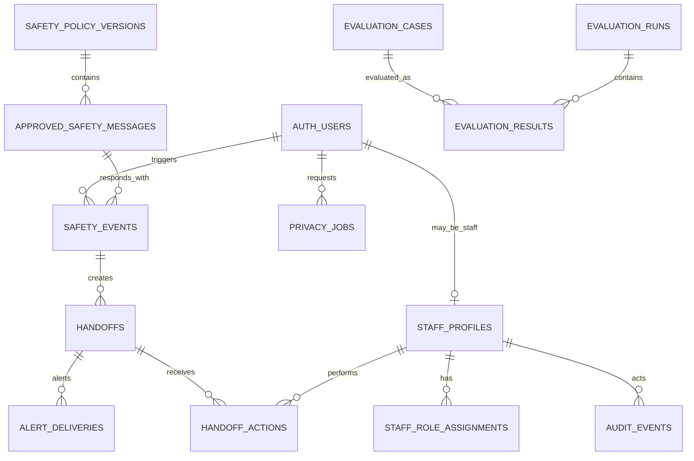

# Module 5 Data Model: Safety, Evaluation and Operations

Companion walkthrough: [Module 5 safety and operations storage flow](module-5-safety-operations-storage-flow.md).

## 1. Outcome and ownership

Module 5 owns two PostgreSQL schemas:

```text
safety_private   restricted safety decisions, handoffs and alerts
operations       staff roles, audit, privacy jobs, analytics and evaluation
```

It receives bounded events from Modules 1–4, performs the approved safety pre-check/decision, protects human handoff data, supports the read-oriented counselor dashboard and evaluates all module outputs.

It does not author safety advice with an LLM, edit assessment/recommendation truth or give general staff unrestricted access to conversations.

## 2. Inputs and outputs

### Inputs

| Input                                   | Producer                         |
| --------------------------------------- | -------------------------------- |
| Student message before AI               | Module 4                         |
| Assessment/journey interruption context | Modules 1 and 4                  |
| User-requested counselor handoff        | Module 4                         |
| Profile/recommendation packet IDs       | Modules 1 and 2                  |
| Staff view/action                       | Authorized counselor dashboard   |
| Export/delete request                   | Student/guardian-authorized flow |
| Evaluation fixture and actual result    | CI or evaluation runner          |
| Privacy-safe funnel event               | Modules 1–4                      |

### Outputs

```ts
type SafetyDecision = {
  decisionId: string;
  triggered: boolean;
  tier?: "tier_1" | "tier_2" | "tier_3";
  approvedMessageKey?: string;
  approvedMessageVersion?: string;
  pauseJourney: boolean;
  createHandoff: boolean;
};

type HandoffPacket = {
  handoffId: string;
  user: { firstName: string; ageBand: string; segment: string };
  profile: { profileSnapshotId?: string; code?: string; confidence?: string };
  trigger: { reason: string; occurredAt: string };
  status: "queued" | "alerted" | "actioned" | "closed";
};
```

## 3. Relationship overview



`AUTH_USERS` represents Supabase `auth.users`; platform users and staff accounts are distinguished through application roles, not separate password tables.

## 4. Safety policy tables

### `safety_private.safety_policy_versions`

Immutable approved policy registry.

| Column                | Type          | Rules                               |
| --------------------- | ------------- | ----------------------------------- |
| `id`                  | `uuid`        | PK                                  |
| `version`             | `text`        | Unique                              |
| `status`              | `text`        | `draft`, `approved`, `retired`      |
| `policy_hash`         | `text`        | Required                            |
| `source_document_ref` | `text`        | Required before production approval |
| `effective_from`      | `timestamptz` | Nullable                            |
| `approved_by`         | `uuid`        | Authorized staff Auth ID            |
| `approved_at`         | `timestamptz` | Nullable                            |
| `created_at`          | `timestamptz` | Required                            |

The missing signed `SAFETY.md` remains a launch blocker. Synthetic POC rules must have an unmistakable non-production version/status.

### `safety_private.approved_safety_messages`

| Column               | Type    | Rules                         |
| -------------------- | ------- | ----------------------------- |
| `id`                 | `uuid`  | PK                            |
| `policy_version_id`  | `uuid`  | FK                            |
| `message_key`        | `text`  | Unique within policy/language |
| `tier`               | `text`  | `tier_1`, `tier_2`, `tier_3`  |
| `language`           | `text`  | Required                      |
| `content`            | `text`  | Human-approved exact copy     |
| `helpline_refs_json` | `jsonb` | Approved IDs/URLs/numbers     |
| `status`             | `text`  | `approved`, `retired`         |
| `content_hash`       | `text`  | Required                      |

No AI service has write access to this table.

### `safety_private.safety_rule_sets`

Versioned deterministic/classifier configuration without storing prompts in general config.

| Column               | Type          | Rules                                   |
| -------------------- | ------------- | --------------------------------------- |
| `id`                 | `uuid`        | PK                                      |
| `policy_version_id`  | `uuid`        | FK                                      |
| `version`            | `text`        | Unique                                  |
| `rule_type`          | `text`        | `deterministic`, `classifier`, `hybrid` |
| `rules_json`         | `jsonb`       | Restricted/versioned fixture/config     |
| `classifier_name`    | `text`        | Nullable approved classifier            |
| `classifier_version` | `text`        | Nullable                                |
| `status`             | `text`        | `draft`, `approved`, `retired`          |
| `approved_at`        | `timestamptz` | Nullable                                |

## 5. Safety events and handoff

### `safety_private.safety_events`

Immutable decision record.

| Column                       | Type          | Rules                                                        |
| ---------------------------- | ------------- | ------------------------------------------------------------ |
| `id`                         | `uuid`        | PK                                                           |
| `user_id`                    | `uuid`        | FK to Auth user                                              |
| `session_id`                 | `uuid`        | Journey/application session reference                        |
| `conversation_id`            | `uuid`        | Nullable Module 4 ID, app validated                          |
| `assessment_run_id`          | `uuid`        | Nullable Module 1 ID, app validated                          |
| `source_event_id`            | `uuid`        | Unique idempotency key                                       |
| `trigger_type`               | `text`        | `message`, `user_request`, `assessment_event`, approved type |
| `tier`                       | `text`        | Nullable when no event is persisted; `tier_1..3`             |
| `decision`                   | `text`        | `triggered`, `not_triggered`, `manual_review`                |
| `rule_set_id`                | `uuid`        | FK                                                           |
| `approved_message_id`        | `uuid`        | Nullable FK                                                  |
| `trigger_excerpt_ciphertext` | `bytea`       | Nullable; encrypted only when policy requires excerpt        |
| `encryption_key_version`     | `text`        | Required with ciphertext                                     |
| `trigger_hash`               | `text`        | Required for integrity/dedup where safe                      |
| `pause_journey`              | `boolean`     | Required                                                     |
| `create_handoff`             | `boolean`     | Required                                                     |
| `occurred_at`                | `timestamptz` | Required                                                     |
| `created_at`                 | `timestamptz` | Required                                                     |

Normal messages should not create permanent `not_triggered` rows containing message content. Aggregate counters may record non-trigger counts without text.

Indexes: `(tier, occurred_at)`, `(user_id, occurred_at desc)`, unique `source_event_id`. Access is restricted and audited.

### `safety_private.handoffs`

| Column                 | Type          | Rules                                                          |
| ---------------------- | ------------- | -------------------------------------------------------------- |
| `id`                   | `uuid`        | PK                                                             |
| `user_id`              | `uuid`        | FK                                                             |
| `safety_event_id`      | `uuid`        | Nullable FK for user-requested non-safety handoff              |
| `reason`               | `text`        | `user_request`, `tier_1`, `tier_2`, `tier_3`, `low_confidence` |
| `priority`             | `smallint`    | Deterministic by policy                                        |
| `profile_snapshot_id`  | `uuid`        | Nullable Module 1 ID                                           |
| `recommendation_ids`   | `uuid[]`      | Bounded Module 2 IDs                                           |
| `conversation_id`      | `uuid`        | Nullable Module 4 ID                                           |
| `contact_available`    | `boolean`     | No contact value stored here                                   |
| `packet_snapshot_json` | `jsonb`       | Minimal restricted versioned packet                            |
| `packet_hash`          | `text`        | Required                                                       |
| `status`               | `text`        | `queued`, `alerted`, `actioned`, `closed`, `cancelled`         |
| `queued_at`            | `timestamptz` | Required                                                       |
| `alerted_at`           | `timestamptz` | Nullable                                                       |
| `actioned_at`          | `timestamptz` | Nullable                                                       |
| `closed_at`            | `timestamptz` | Nullable                                                       |

Queue ordering: priority first (Tier 1 highest), then `queued_at`.

### `safety_private.alert_deliveries`

| Column                    | Type          | Rules                                   |
| ------------------------- | ------------- | --------------------------------------- |
| `id`                      | `uuid`        | PK                                      |
| `handoff_id`              | `uuid`        | FK                                      |
| `channel`                 | `text`        | Approved alert adapter                  |
| `destination_ref_hash`    | `text`        | No plaintext destination                |
| `provider_reference_hash` | `text`        | Nullable                                |
| `status`                  | `text`        | `queued`, `sent`, `delivered`, `failed` |
| `attempt_number`          | `smallint`    | Positive                                |
| `error_code`              | `text`        | Nullable safe code                      |
| `queued_at`               | `timestamptz` | Required                                |
| `completed_at`            | `timestamptz` | Nullable                                |

Unique `(handoff_id, channel, attempt_number)`. Tier-1 delivery failure remains visible for escalation.

### `safety_private.handoff_actions`

Append-only counselor action log.

| Column                   | Type          | Rules                                                                         |
| ------------------------ | ------------- | ----------------------------------------------------------------------------- |
| `id`                     | `uuid`        | PK                                                                            |
| `handoff_id`             | `uuid`        | FK                                                                            |
| `actor_staff_id`         | `uuid`        | FK to operations staff profile                                                |
| `action_type`            | `text`        | `viewed`, `claimed`, `contact_attempted`, `actioned`, `closed`, approved type |
| `action_category`        | `text`        | Nullable approved category                                                    |
| `note_ciphertext`        | `bytea`       | Nullable restricted encrypted note                                            |
| `encryption_key_version` | `text`        | Required with note                                                            |
| `occurred_at`            | `timestamptz` | Required                                                                      |

An action row is never edited; correction is a new action.

## 6. Staff authorization

### `operations.staff_profiles`

| Column         | Type          | Rules                                        |
| -------------- | ------------- | -------------------------------------------- |
| `user_id`      | `uuid`        | PK/FK to `auth.users`                        |
| `display_name` | `text`        | Required                                     |
| `staff_status` | `text`        | `invited`, `active`, `suspended`, `disabled` |
| `mfa_required` | `boolean`     | True for all Phase A staff                   |
| `created_at`   | `timestamptz` | Required                                     |
| `updated_at`   | `timestamptz` | Required                                     |

Passwords and TOTP secrets are not stored in application tables; use Supabase Auth/MFA or another approved identity provider.

### `operations.staff_role_assignments`

| Column          | Type          | Rules                                                 |
| --------------- | ------------- | ----------------------------------------------------- |
| `id`            | `uuid`        | PK                                                    |
| `staff_user_id` | `uuid`        | FK                                                    |
| `role`          | `text`        | `counselor`, `supervisor`, `auditor`, `data_reviewer` |
| `scope_json`    | `jsonb`       | Bounded state/program scope; nullable                 |
| `granted_by`    | `uuid`        | Staff Auth ID                                         |
| `granted_at`    | `timestamptz` | Required                                              |
| `expires_at`    | `timestamptz` | Nullable                                              |
| `revoked_at`    | `timestamptz` | Nullable                                              |

Active role uniqueness prevents accidental duplicate assignments.

## 7. Audit and privacy jobs

### `operations.audit_events`

Append-only metadata audit; never a dumping ground for payloads.

| Column                   | Type          | Rules                                    |
| ------------------------ | ------------- | ---------------------------------------- |
| `id`                     | `uuid`        | PK                                       |
| `actor_type`             | `text`        | `user`, `staff`, `service`, `job`        |
| `actor_id`               | `uuid`        | Nullable for system actor                |
| `action`                 | `text`        | Approved catalog                         |
| `target_type`            | `text`        | Required                                 |
| `target_id`              | `uuid`        | Nullable when aggregate action           |
| `request_correlation_id` | `uuid`        | Required                                 |
| `safe_metadata_json`     | `jsonb`       | PII-free bounded metadata                |
| `ip_hash`                | `text`        | Nullable under approved retention policy |
| `occurred_at`            | `timestamptz` | Required                                 |

Indexes: actor/time, target/time, correlation ID. No phone, OTP, raw message, secret or full safety note.

### `operations.privacy_jobs`

| Column                 | Type          | Rules                                                   |
| ---------------------- | ------------- | ------------------------------------------------------- |
| `id`                   | `uuid`        | PK                                                      |
| `user_id`              | `uuid`        | FK to Auth user                                         |
| `job_type`             | `text`        | `export`, `delete`                                      |
| `requested_by`         | `uuid`        | Authorized principal/staff ID                           |
| `authorization_method` | `text`        | Approved verification method                            |
| `status`               | `text`        | `queued`, `running`, `completed`, `failed`, `cancelled` |
| `deadline_at`          | `timestamptz` | Required                                                |
| `result_asset_ref`     | `text`        | Nullable private export asset                           |
| `result_expires_at`    | `timestamptz` | Nullable                                                |
| `attempt_count`        | `smallint`    | Non-negative                                            |
| `error_code`           | `text`        | Nullable safe code                                      |
| `requested_at`         | `timestamptz` | Required                                                |
| `completed_at`         | `timestamptz` | Nullable                                                |

Unique active job per user/type. Workers are idempotent and record module-by-module completion without retaining deleted content.

### `operations.privacy_job_steps`

Tracks deletion/export across module boundaries:

```text
id, privacy_job_id, module_code, status, attempt_count,
started_at, completed_at, error_code
```

No exported content is stored in step metadata.

## 8. Privacy-safe analytics

### `operations.analytics_events`

| Column                   | Type          | Rules                                    |
| ------------------------ | ------------- | ---------------------------------------- |
| `id`                     | `uuid`        | PK                                       |
| `event_name`             | `text`        | Approved funnel/event catalog            |
| `anonymous_analytics_id` | `uuid`        | Rotatable/non-auth identifier per policy |
| `segment`                | `text`        | Nullable                                 |
| `instrument_code`        | `text`        | Nullable                                 |
| `journey_step`           | `smallint`    | Nullable                                 |
| `state`                  | `text`        | Nullable full state/UT name if approved  |
| `duration_ms`            | `integer`     | Nullable non-negative                    |
| `count_value`            | `integer`     | Nullable                                 |
| `safety_tier`            | `text`        | Nullable; never trigger text             |
| `properties_json`        | `jsonb`       | Strict allowlist, no free text           |
| `occurred_at`            | `timestamptz` | Required                                 |

No first name, phone, city, answer, message, recommendation title or safety excerpt is allowed.

## 9. Evaluation tables

### `operations.evaluation_cases`

Versioned test/evaluation definition.

| Column              | Type          | Rules                                                                         |
| ------------------- | ------------- | ----------------------------------------------------------------------------- |
| `id`                | `uuid`        | PK                                                                            |
| `case_key`          | `text`        | Unique with version                                                           |
| `version`           | `text`        | Required                                                                      |
| `module_code`       | `text`        | `m1` through `m5` or `integrated`                                             |
| `category`          | `text`        | scoring, matching, retrieval, grounding, safety, privacy, accessibility, load |
| `severity`          | `text`        | `blocking`, `warning`                                                         |
| `fixture_refs_json` | `jsonb`       | Versioned repository/data refs                                                |
| `input_json`        | `jsonb`       | Synthetic/approved test input                                                 |
| `expected_json`     | `jsonb`       | Exact output/invariants                                                       |
| `assertions_json`   | `jsonb`       | Machine-readable assertions                                                   |
| `status`            | `text`        | `draft`, `active`, `retired`                                                  |
| `created_at`        | `timestamptz` | Required                                                                      |

Production personal data is forbidden in evaluation cases.

### `operations.evaluation_runs`

| Column                  | Type          | Rules                                                    |
| ----------------------- | ------------- | -------------------------------------------------------- |
| `id`                    | `uuid`        | PK                                                       |
| `run_type`              | `text`        | `ci`, `manual`, `scheduled`, `release`                   |
| `git_revision`          | `text`        | Required                                                 |
| `environment`           | `text`        | test/staging; production only if approved non-PII checks |
| `fixture_versions_json` | `jsonb`       | Required                                                 |
| `status`                | `text`        | `running`, `passed`, `failed`, `cancelled`               |
| `started_at`            | `timestamptz` | Required                                                 |
| `completed_at`          | `timestamptz` | Nullable                                                 |
| `summary_json`          | `jsonb`       | Counts/metrics only                                      |

### `operations.evaluation_results`

| Column               | Type          | Rules                                  |
| -------------------- | ------------- | -------------------------------------- |
| `id`                 | `uuid`        | PK                                     |
| `evaluation_run_id`  | `uuid`        | FK                                     |
| `evaluation_case_id` | `uuid`        | FK                                     |
| `status`             | `text`        | `passed`, `failed`, `error`, `skipped` |
| `actual_json`        | `jsonb`       | Bounded synthetic result/evidence      |
| `metrics_json`       | `jsonb`       | Typed metrics                          |
| `failure_codes`      | `text[]`      | Approved codes                         |
| `duration_ms`        | `integer`     | Non-negative                           |
| `created_at`         | `timestamptz` | Required                               |

Unique `(evaluation_run_id, evaluation_case_id)`. A model-graded score cannot be the sole blocking assertion for safety or deterministic correctness.

## 10. Input-to-storage-to-output matrix

| Use case          | Inputs                             | Writes                                  | Output                       |
| ----------------- | ---------------------------------- | --------------------------------------- | ---------------------------- |
| Safety pre-check  | message/context/rule version       | triggered event only as policy requires | `SafetyDecision`             |
| Create handoff    | decision/user request/profile refs | handoff/alert rows                      | `HandoffPacket`              |
| Counselor action  | role/action/category               | handoff action + audit                  | Updated queue DTO            |
| Staff packet view | authorized staff/target            | audit event                             | Redacted packet              |
| Export            | authorized request                 | privacy job/steps/asset metadata        | Expiring export              |
| Delete            | authorized request                 | privacy job/steps                       | Completion status            |
| Emit analytics    | allowlisted event                  | analytics event                         | Accepted/no content response |
| Evaluate          | cases/fixtures/build               | run/results                             | Blocking/warning report      |

## 11. State transitions

### Handoff

```text
queued → alerted → actioned → closed
   └──────────────→ cancelled (policy-permitted only)
```

Tier 1 must enter the highest-priority queue and create an immediate alert attempt.

### Privacy job

```text
queued → running → completed
                └→ failed → running
queued → cancelled (before destructive execution only)
```

### Evaluation run

```text
running → passed
       ├→ failed
       └→ cancelled
```

## 12. Access control matrix

| Data/action                |                Student |         Counselor |    Supervisor |      Auditor |        Service |
| -------------------------- | ---------------------: | ----------------: | ------------: | -----------: | -------------: |
| Own consent/profile status |       yes via Module 1 |       packet only |   packet only | audited view |         scoped |
| Safety event detail        |      no general access |    flagged packet |           yes |   read/audit | safety service |
| Trigger excerpt/note       |                     no |     policy-scoped | policy-scoped | audit-scoped |     restricted |
| Queue action               |                     no |           allowed |       allowed |           no |  workflow only |
| Audit log                  | own rights export only |        no general |        scoped |          yes |         append |
| Evaluation results         |                     no | summary if needed |       summary |         read |         runner |
| Privacy request            |            own request |       assist only |       oversee |        audit |         worker |

Every restricted read/action writes an audit event. Database grants and application authorization both enforce the matrix.

## 13. Retention

- Safety-event and excerpt retention follows signed `SAFETY.md` and legal/privacy policy.
- Restricted excerpts/notes are minimized and encrypted when retained.
- Handoff operational data is retained only for the approved service/audit period.
- Audit metadata has a defined retention period and contains no raw payloads.
- Analytics events are de-identified/allowlisted and deleted/aggregated on schedule.
- Evaluation cases/results contain synthetic data and may be retained for regression history.
- Privacy export assets expire and are deleted automatically.

## 14. Migration slices

```text
m5_001_restricted_schemas_roles
m5_002_safety_policy_copy_rules
m5_003_safety_events_handoffs_alerts
m5_004_staff_roles_audit
m5_005_privacy_jobs
m5_006_analytics
m5_007_evaluation
m5_008_indexes_privileges_retention
```

## 15. Required tests

- Approved copy hash/text is returned exactly for each fixture.
- General AI cannot run before safety pre-check completes.
- Duplicate source event creates one safety event/handoff.
- Tier 1 creates highest-priority queue item and alert attempt.
- Normal career questions do not persist raw message in safety tables.
- Unauthorized staff cannot view packet/excerpt/action queue.
- Every restricted packet view/action writes audit metadata.
- No password/TOTP secret exists in application tables.
- Export/delete workers are idempotent across module steps.
- Analytics rejects free text and prohibited property keys.
- Broken TV/scoring, hallucinated entity or missing safety copy fails a release run.
- Model grading alone cannot pass a failed deterministic/safety assertion.

## 16. Open decisions

| Decision                                             | Status                |
| ---------------------------------------------------- | --------------------- |
| Signed `SAFETY.md`, exact tiers/copy/retention       | Open P0               |
| Counselor staffing, priority and response SLAs       | Open P0 operational   |
| Alert provider/channels and retry escalation         | Proposed              |
| Encryption/key-management service for excerpts/notes | Security decision     |
| Exact RBAC scopes and packet fields                  | Privacy/safety review |
| Analytics identifier/retention policy                | Privacy review        |
| Export format and deletion exceptions                | Legal/privacy review  |

## 17. Module-ready criteria

- Restricted schemas are inaccessible to ordinary application/frontend roles.
- Safety decisions/copy are versioned, deterministic and non-LLM-authored.
- Queue, alert and staff actions are idempotent and audited.
- Privacy jobs coordinate deletion/export across all modules.
- Evaluation covers Modules 1–4 plus safety itself.
- Synthetic red-team and authorization suites pass before integration.
