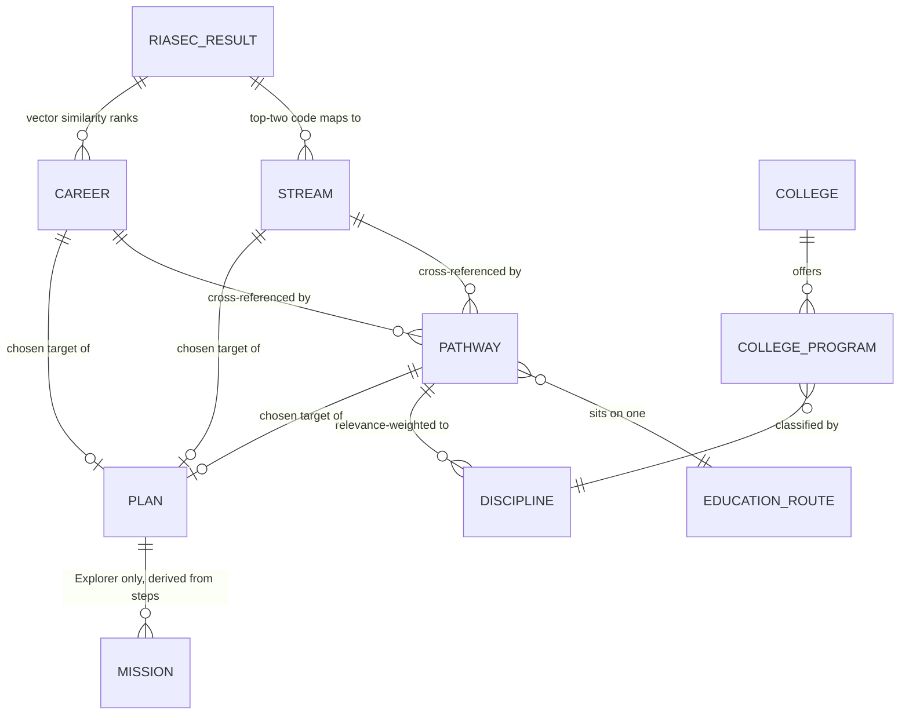

# Domain Glossary — Stream, Pathway, Discipline, College, Plan

> **What this file is for:** you asked what actually *defines* a stream, what a "college
> group"/"school group" is, and what defines a pathway/college/plan — in plain terms, not code.
> Every definition below is traced back to (a) the PRD's own words
> (`docs/reference/yuvanext-prd-tamil.md` — bilingual, technical terms stay in English even in
> the Tamil sections) and (b) the schema that actually implements it
> (`docs/data-model/module-3-knowledge-data-model.md` for the catalog, `module-2-...` for
> scoring). No new concepts are invented here — this is a plain-English reading of what already
> exists, laid out so the *chain* between the five concepts is obvious.

---

## 0. One-line answer to "what defines what"

| Concept | One-line definition | Real-world example |
|---|---|---|
| **Stream** | A *subject combination a student studies* — the school-level choice of "what kind of subjects." | "Science with Mathematics", "Commerce with Applied Mathematics", "Vocational Technology" |
| **Education Route** | The *level/format of study* a pathway happens through — not a subject choice, a structural one. | `degree`, `diploma`, `iti`, `certificate`, `postgraduate`, `open`, `school_stream` |
| **Pathway** | A *specific course of study* — one named program, sitting on top of one Education Route, that leads toward one or more careers. | "BSc Data Science" (route: degree), "ITI Electrician" (route: iti), "Diploma in Computer Engineering" (route: diploma) |
| **Discipline** | The *field-of-study label* that connects a Pathway to the Colleges that teach it — the thing both sides point at. | "Computer Science", "Civil Engineering", "Commerce" |
| **College** | The *institution* — a physical place with a state, city, type and tier, offering one or more programs. | "Coimbatore Polytechnic Institute, Tamil Nadu, polytechnic, tier 2" |
| **Plan** | The *action checklist* generated once a target (career/pathway/stream) is chosen — weekly for Explorer, day-windowed (1–30/31–60/61–90) for Pathfinder and Launcher. | "Pathfinder Route Plan", "Launcher 90-Day Plan" |

There is **no literal "college group" or "school group" table anywhere in this system** — see
§1 for why that phrase doesn't map to a real entity, and what it probably *should* map to.

---

## 1. First, clearing up "group" — because the codebase deliberately doesn't use that word

In everyday Tamil Nadu schooling language, "Group" (Group 1, Group 2A, Group 2, Group 3...) is
what people call the +1/+2 subject combination — the same thing this PRD and codebase call a
**Stream**. That's almost certainly where your "school group" instinct is coming from — it's
the same concept, different word. The PRD/schema picked "Stream" as the one canonical term on
purpose (`knowledge.stream_options` — see §2), so nowhere in the code will you find a `group`
column; wherever you'd think "group," read "stream" instead.

"College group" doesn't map to one thing — it's actually two *separate* real concepts people
often blur together:

1. **Institution type** (`knowledge.colleges.institution_type`) — *what kind of place it is*:
   `university`, `college`, `polytechnic`, `iti`, `open`. This is what
   `college-recommendations.ts` calls an "access route" — vocational/polytechnic/ITI/open
   institutions get treated as easier-entry options and are guaranteed a slot in the outer ring.
2. **Discipline** (`knowledge.disciplines`) — *what subject/field it teaches* — see §3. This is
   what actually filters "which colleges are even relevant to this student," not institution
   type.

So: if you meant "what groups colleges by type" → **institution_type**. If you meant "what
groups colleges by field" → **discipline**. Neither is called "group" in the schema.

---

## 2. Stream — the subject-combination choice

**Definition:** a Stream is a named combination of school/college subjects a student commits
to — it answers *"what kind of subjects will you study,"* not *"what specific course/degree."*
It's the earliest, broadest fork in the whole system.

**Where it's defined:** `knowledge.stream_options` (`docs/data-model/module-3-knowledge-data-model.md`
§5) — just four columns: `id`, `stream_code`, `title`, `description`, `status`. Deliberately
thin — a Stream doesn't carry marks bands, RIASEC letters, or segment fit *itself*; those live
one join away, on `stream_maps`/`stream_map_items`, which is what actually *recommends* a
stream to a specific student (keyed by their top-two RIASEC letters — `top_two_code`).

**Real example**, straight from the seed data (`data/seed/knowledge/streams/2026-07-31/streams.json`):

```json
{ "streamCode": "science-mathematics", "title": "Science with Mathematics",
  "description": "Builds foundations in mathematics, science, and analytical problem-solving." }
{ "streamCode": "vocational-technology", "title": "Vocational Technology",
  "description": "Develops practical technical skills through applied learning." }
```

**How a student gets one recommended:** their RIASEC result's top-two letters (e.g. `"RI"`)
looks up a `stream_maps` row for that code → its `stream_map_items` rank the stream options in
order, each with an approved `reason_key` (e.g. `ri-analytical-foundation`). Nothing here is a
career or a college yet — just "which subjects fit how your mind works."

**Who sees it:** Explorer and Pathfinder always; Launcher only if their goal reopens a
field/degree decision (`docs/poc/launcher-goal-based-recommendations.md` Rule A). PRD's own
words for what a Stream recommendation set actually contains, per segment (`module-2-recommendation-planning.md`
line 110): *"Explorer: stream suggestions and three safe exploration missions."*

---

## 3. Education Route + Pathway — the specific course, and the shape it takes

These are two different layers that are easy to conflate, so take them one at a time.

### 3.1 Education Route — the *format*, not the *subject*

**Definition:** what *kind* of program structure a course of study is — a degree, a diploma, a
certificate, an ITI trade, postgraduate study, or an "open"/distance format. This is a small,
fixed, controlled vocabulary (`knowledge.education_routes.route_level`:
`school_stream | certificate | iti | diploma | degree | postgraduate | open`) — it never grows
per-student, it's a structural classification.

### 3.2 Pathway — one specific, named program sitting on top of a Route

**Definition:** a Pathway is the actual thing a student would enroll in — "BSc Data Science,"
not "a degree." It's what streams and careers both eventually point at as their real-world
destination. Every Pathway:

- sits on exactly one Education Route (`education_route_id`),
- links to one or more Careers it feeds into (`knowledge.career_pathways`, tagged `primary`,
  `alternative`, or `vocational`),
- optionally names a backup route (`backup_route_note`) — e.g. "a related diploma or
  certificate can provide an alternative starting point" — so every Pathway can honestly answer
  "what if this doesn't work out."

**Real examples** (same seed file):

| Pathway | Route | Duration | Backup route |
|---|---|---|---|
| BSc Data Science | degree | 3–4 years | A related diploma or certificate |
| ITI Electrician | iti | 1–2 years | A short electrical certificate |
| Diploma in Computer Engineering | diploma | 2–3 years | An approved certificate or open-learning route |

**How it's scored for a student:** `pathway-recommendations.ts` blends how well the Pathway's
linked careers/streams match the student's own top-ranked career/stream lists, plus marks-band
fit and a reachability score (0.30 low / 0.65 medium / 1.00 high, per
`recommendation.feasibility_rules`) and whether it has a backup route.

**Who sees it:** Pathfinder always; Launcher only when their goal reopens a field/degree
decision (`higher_studies`/`not_sure`). PRD: *"Pathfinder: 3–5 pathway clusters with
degree/exam/college and backup-route references"* (`module-2-recommendation-planning.md` line
111).

---

## 4. Discipline — the connective tissue nothing else can substitute for

**Definition:** a Discipline is a controlled field-of-study label (`knowledge.disciplines`:
`id`, `discipline_code`, `title`, `domain_code`, `status` — e.g. "Computer Science", "Civil
Engineering", "Commerce"). Its entire job is being the **shared vocabulary** that lets two
otherwise-unrelated tables talk to each other:

```
Pathway ──(knowledge.pathway_disciplines, relevance_weight)──> Discipline <──(knowledge.college_programs)── College
```

Without Discipline, there would be no way to answer "which colleges actually teach what this
Pathway leads to" — a Pathway doesn't name a college, and a College doesn't name a pathway; they
both point at a Discipline, and the college-ranking code (`college-recommendations.ts`) joins
through it via `targetDisciplineIds`.

This is also the piece flagged as unfinished in
`docs/poc/launcher-goal-based-recommendations.md` Part 2 — a confirmed "this career maps to
this discipline" link (for the Launcher `skill_building` case, which has no Pathway to read a
discipline from) isn't built yet. Worth keeping in mind for §5.

---

## 5. College (+ College Program) — the institution and what it actually teaches

**Definition:** a College is a real institution — `knowledge.colleges`: `name`, `city`,
`state`, `institution_type`, `tier` (human-set only — never AI-inferred, see the schema
comment), `admission_route`, `fees_band`, `verification_status`. On its own, a College record
says nothing about *what it teaches* — that's `knowledge.college_programs`, a separate table
linking `college_id` → `discipline_id` with its own `program_name`, `qualification_level`,
`duration_band`, `admission_route`, `fees_band`. One college can offer many programs across many
disciplines.

**How it's scored/ringed for a student:** `college-recommendations.ts` weighs discipline overlap
(45%), tier (20%), state proximity (25% — home state / neighboring / elsewhere), and whether the
institution type is an easier-entry "access route" (10%) — then partitions the ranked list into
inner/middle/outer rings by state, always guaranteeing at least one vocational/polytechnic/ITI/
open option somewhere in the results. PRD: *"College rings"* ranked *"by discipline
intersection, then tier, then state proximity, then name"* (`module-2-recommendation-planning.md`
line 94).

**Who sees it:** Pathfinder always; Launcher when their goal involves enrolling anywhere at all
(`higher_studies`/`not_sure`/`skill_building` — narrowed to vocational/polytechnic/ITI/open for
`skill_building`, per Rule A2 in the launcher doc).

---

## 6. Plan (and Missions) — the action checklist at the end of the chain

**Definition:** a Plan is a deterministic, template-filled sequence of steps generated once a
target (a career, pathway, or stream) has been picked out by the scoring above. It's not scored
or ranked itself — it's rendered from `recommendation.plan_templates` +
`plan_template_steps`, with `{{targetTitle}}`-style placeholders filled from the student's
actual top match. Its *shape* depends on segment:

| Segment | Shape | PRD wording |
|---|---|---|
| Explorer | 3 weekly steps → also surfaced as gamified "missions" (`recommendation.missions`) | *"streams + 3 missions"* |
| Pathfinder | Being moved to a 90-day (1–30/31–60/61–90) shape framed around their top pathway (see the companion plan, `docs/poc/stream-college-plan-ai-integration.md` §4) | *"3–5 clusters, degrees, exams, state-filtered colleges, backup routes"* |
| Launcher | 90-day (1–30/31–60/61–90) shape framed around their top career | *"ranked careers, 90-day plan"* |

Every step comes from an approved template — there is no free-text or AI-generated plan
content; "generating a plan" means *selecting and filling* a pre-approved template, not writing
new prose.

---

## 7. The whole chain, worked end to end (one concrete student)

Using Arjun from `docs/poc/launcher-goal-based-recommendations.md` §4.2 — Pathfinder, Bengaluru,
Karnataka, high marks band, top interests Investigative/Realistic/Conventional:

```
RIASEC result (I, R, C)
        │
        ▼
Stream ─────────────► "Science with Computer Science" (92% fit)
        │              — a subject combination, nothing enrolled in yet
        ▼
Pathway ────────────► "BSc Computer Science" (reachability: High 1.0, backup: Diploma in
        │              Computer Applications)
        │              — the specific course this stream leads toward
        ▼
Discipline ─────────► "Computer Science" (the shared label — invisible to the student, does
        │              the join under the hood)
        ▼
College ────────────► "Bengaluru Design College" (inner ring — home state, matches the
        │              discipline, decent tier)
        ▼
Plan ───────────────► "Pathfinder Route Plan" targeting BSc Computer Science:
                         Week 1 — compare entry routes for BSc Computer Science
                         Week 2 — list backup routes for this pathway
```

Career sits alongside this chain rather than strictly before or after it — Career and Stream
are both derived independently from the RIASEC result, and Pathway cross-references *both*
ranked lists (`rankedCareerIds` + `rankedStreamIds` in `pathway-recommendations.ts`) rather than
one feeding the other.

---

## 8. Relationship diagram



Discipline is the only node with two independent parents (Pathway *and* College) — that's what
makes it the join key described in §4, not a coincidence of the diagram layout.

---

## 9. Quick cross-reference table

| Concept | DB table(s) | Domain scoring file | PRD line |
|---|---|---|---|
| Stream | `knowledge.stream_options`, `stream_maps`, `stream_map_items` | `stream-recommendations.ts` | `module-2-recommendation-planning.md:110` |
| Education Route | `knowledge.education_routes` | (not scored directly — feeds Pathway) | `module-3-knowledge-data-model.md` §5 |
| Pathway | `knowledge.pathways`, `career_pathways` | `pathway-recommendations.ts` | `module-2-recommendation-planning.md:111` |
| Discipline | `knowledge.disciplines`, `pathway_disciplines`, `college_programs` | consumed by `college-recommendations.ts` via `targetDisciplineIds` | `launcher-goal-based-recommendations.md` Part 3, Rule A2 |
| College | `knowledge.colleges`, `college_programs` | `college-recommendations.ts` | `module-2-recommendation-planning.md:92,94` |
| Plan / Mission | `recommendation.plan_templates`, `plan_template_steps`, `generated_plans`, `generated_plan_steps`, `missions` | `plan-generation.ts` | `yuvanext-prd-tamil.md:220-222` |
